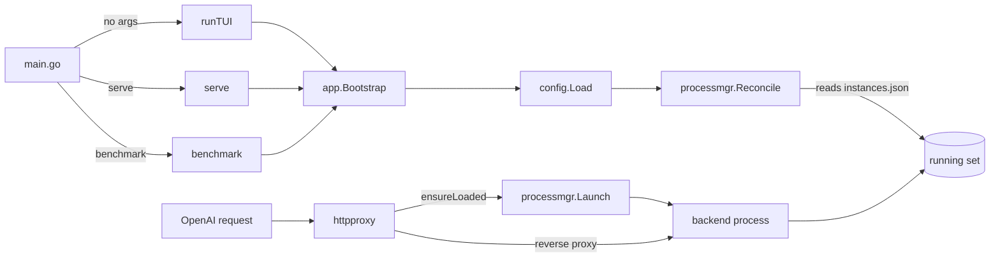

# AGENTS.md — model-loader

**Repository knowledge base.** Synthesized 2026-06-23 from a multi-agent exploration of the live tree (project/architecture, backend & services, TUI, CLI/UX, build/DevOps, and tests/QA slices), cross-checked against source.

> Root `AGENTS.md` and `CLAUDE.md` are **git-tracked and kept byte-identical**. The `.gitignore` still lists `AGENTS.md` (L49) from an earlier convention, but both root files are committed, so that entry is effectively moot here. **Per-directory knowledge bases exist as both `AGENTS.md` (12 dirs) and `CLAUDE.md` (39 dirs) and are all populated** — every tracked `CLAUDE.md` carries content (e.g. `internal/service/processmgr/CLAUDE.md` ≈7.8 KB). Read whichever sits in the directory you are working in; this root file is the map.

---

## 1. Project Overview

**model-loader** is a Go 1.26.2 terminal UI **and** headless CLI for running local LLM inference servers on a single workstation (reference rig: an RTX 3090, 24 GiB). It manages *launch profiles*, supervises backend *processes*, and fronts them with one OpenAI-shaped HTTP proxy that hot-swaps the active model on demand.

- **Who it is for:** a single operator (power user / ML engineer) curating many tuned launch configs for one GPU. It is **not** a multi-tenant service — the proxy binds loopback and ships no auth, and is guarded by a single-instance lock.
- **What it does:** author profiles via a schema-driven web editor → launch a backend through `processmgr` → route inference through the proxy (the request `model` field selects the profile) → monitor logs/slots/GPU/throughput → browse local GGUF + Hugging Face → benchmark profiles.
- **Backends (8 `BackendKind`s, `internal/domain/`):** `llama-server`, `vllm`, `sglang`, `dflash`, `buun-llama-cpp`, `beellama-cpp`, `unsloth`, `tabby`. The user registers each backend (binary + kind) in the catalog; the tool downloads no engines itself.
- **Surfaces:** a 5-tab TUI (default, no subcommand), a headless `serve` proxy daemon, and a full Cobra CLI mirroring the TUI. Processes are deliberately **orphaned** on TUI exit so inference survives.
- **Module:** `github.com/quantmind-br/model-loader` · **Repo:** https://github.com/quantmind-br/model-loader

---

## 2. Architecture & Data Flow

### 2.1 Module map

| Layer | Path | Role |
|-------|------|------|
| Entry / dispatch | `cmd/model-loader/main.go` | `cli.TUIRunner = runTUI`; `cli.Execute()`. `runTUI` takes the flock, calls `app.Bootstrap`, wires TUI-only services + 5 pages, runs `tea.NewProgram(root, WithAltScreen)`; on exit logs (does not kill) orphaned instances |
| Dev tools | `cmd/regenerate-schemas/`, `cmd/scripts/print_args.go` | `go run` helpers (re-parse every backend `--help`; print resolved args) — not CLI subcommands |
| Shared bootstrap (DI) | `internal/app/bootstrap.go` | One `Services` container for TUI, CLI, and headless modes |
| Config | `internal/config/` | Viper TOML loader + one-time migrations |
| CLI | `internal/cli/` | Cobra tree; never imports `internal/ui` |
| TUI | `internal/ui/` | Bubble Tea 5-tab `RootModel`, pages, components, theme |
| Domain | `internal/domain/` | `Profile`, `Instance`, `Backend`, `FlagSchema`, `BackendValidationSchema`, `Presentation`, `BackendKind` — zero external deps |
| Services | `internal/service/*` | **26** self-contained packages, one concern each (§2.2) |
| Logging | `internal/log/` | file-only `slog`, rotate-by-session, `log.Nop()` fallback |
| Leaf utils | `internal/service/internal/{fsx,procutil,ptrutil}` | `WriteJSONAtomic`/`WriteJSONExclusive`/`ReadJSON[T]`; `Alive(pid)`; generic `Ptr[T]` |

### 2.2 Service layer (26 packages)

Each owns one concern, exports its own interface, takes a `Config` with functional options (`WithLogger`…), and falls back to `log.Nop()` rather than a nil logger.

| Service | Purpose |
|---------|---------|
| `processmgr` | Process lifecycle, recovery, history, watchdog, liveness — **largest service** |
| `httpproxy` | OpenAI-shaped reverse proxy with implicit model swap |
| `proxysupervisor` | Detached-proxy state machine (idle→starting→running→stopping); `proxy-state.json` |
| `backendcatalog` | Multi-backend catalog (`catalog.json`) + profile→exe/schema resolver + prober |
| `backendschema` | Schema-generation orchestrator (`--help` parse + curated overlay + embedded fallback) |
| `llamahelp` | llama-server `--help` parser + **embedded v9761** schema |
| `buunhelp`/`dflashhelp`/`sglanghelp`/`vllmhelp`/`unslothhelp`/`tabbyhelp` | Embedded/curated schemas (Python/native `--help` too unstable to parse live) |
| `llamabin` | Binary path resolver (PATH + Python fallback) |
| `profilestore` | Profile JSON persistence (one file per profile; per-file flock RMW; export/import; history) |
| `downloadmgr` | Hugging Face download queue + detached worker subprocesses |
| `hfhub` | HF Hub API client (search, repo info, download; `HF_BASE_URL` override) |
| `modelscanner` | GGUF metadata scan (magic `0x46554747`, header, KV; quant/params regex) |
| `monitor` | Logs/slots/GPU/metrics stream via `Subscribe` (nvidia-smi) |
| `metricsstore` | Rolling metrics time-series (Append/Read/Compact) |
| `benchmark`/`benchmarkstore` | Eval engine (judge, math/codegen/ragas/summary/instruction/mmlu, llama-bench, longctx) + per-run JSON |
| `validator` | Flag + cross-field validation, `Report` aggregation |
| `migration` | One-time legacy-binary-path → backend-ID migration |
| `playground` | OpenAI chat SSE client (UI modal currently inert, DEAD-01) |
| `sizing` | GPU-memory fit calculator (`Suggest`, `Fit` Green/Yellow/Red) |
| `configweb` | On-demand in-process web profile/backend editor (HTMX/Alpine) |

### 2.3 State & on-disk layout

```
~/.config/model-loader/
  config.toml                       # app config (TOML, Viper)
  profiles/<id>.json                # one file per profile (id == basename); .history/<id>.previous.json backups; .<id>.lock
  backends/catalog.json             # registered backends
  backends/schemas/<id>.json        # per-backend validation schema
~/.local/state/model-loader/
  model-loader.lock                 # single-instance flock target
  instances.json / instances-history.json   # running / exited registries
  proxy-state.json                  # proxy supervisor state
  logs/<profile-id>-<port>.log      # merged backend stdout+stderr
  metrics/<profileID>/*.jsonl       # metrics time-series
  benchmark/runs/*.json (+ .transcript.json sidecars)
  downloads/dl-<id>.json            # per-download worker state
```

### 2.4 Service routes (HTTP proxy — the only client channel to backends)

Default bind `127.0.0.1:4321`, **loopback-only / no auth**, 180 s health-check wait, 8 MiB body buffer, 10 s shutdown grace. Swaps + kills serialize on `swapMu`; in-flight tracked via `atomic` + `WaitGroup` — **only the catch-all and `/v1/messages` increment `inflightWG`**; admin endpoints and `count_tokens` must not touch it or the drain self-deadlocks. `Status` JSON tags are snake_case (the supervisor decodes them; a PascalCase `UnmarshalJSON` fallback keeps old states readable). Errors are OpenAI-enveloped, except the two Anthropic routes which use `{"type":"error","error":{...}}`.

| Method | Path | Purpose |
|--------|------|---------|
| `*` | `/` (catch-all) | Reverse-proxied to the loaded backend; `"model"` in body (or `?model=`) triggers an **implicit swap** |
| `POST` | `/v1/messages` | **Anthropic Messages API**, translated in-proxy to the backend's OpenAI `/v1/chat/completions` (`anthropic_*.go`): full SSE event sequence, tools, images, system; backend `reasoning_content` ↔ `thinking` blocks; **reasoning controls** (`thinking`/`output_config.effort` → canonical pivot → `reasoning_effort` + `chat_template_kwargs.enable_thinking`), `metadata.user_id`→`user`, tool-schema `properties:{}` normalization, inline `{"role":"system"}`→`<system-reminder>` user turns. Strict model resolution (unknown → 404 `not_found_error`); same implicit-swap + inflight semantics as the catch-all. Never routed through `loaded.proxy` (its `ModifyResponse` would destroy the reasoning mapping) |
| `POST` | `/v1/messages/count_tokens` | **Local tiktoken count** over the translated OpenAI request (`tiktoken-go`, o200k_base for local models; from CLIProxyAPI) + flat per-image cost; validates the profile exists but never launches/contacts a backend and never touches inflight |
| `POST` | `/v1/responses` | **OpenAI Responses API** translated to the backend's chat completions (`responses_*.go`): input string/array, `instructions`→system, function_call/function_call_output, `reasoning.effort`, full Responses event-stream. Same swap + inflight semantics as `/v1/messages` |
| `*` | `/v1beta/models` · `/v1beta/models/{model}:{generateContent\|streamGenerateContent\|countTokens}` | **Gemini API** translated to chat completions (`gemini_*.go`): contents/parts, systemInstruction, functionCall/functionResponse (FIFO id pairing), thinkingConfig→reasoning, `data:`-only SSE stream; `{model}` may carry a `(level)` reasoning suffix. `GET /v1beta/models` lists profiles in Gemini shape |
| `GET` | `/v1/models` | Registered profiles as **OpenRouter-shaped** model objects (mirrors `/api/v1/models`; non-applicable fields emitted empty) **plus** OpenAI's `object:"model"` and `owned_by` (the profile's `launch.backendId`). Image modality is derived from the mmproj flag **or** a VL marker in the model name (so flag-less vLLM/SGLang VL models report `text+image->text`). Built from `profilestore`; envelope keeps `{object:"list"}` |
| `GET` | `/_status` | `running, loaded_profile_id, loaded_pid, loaded_port, inflight_requests, last_swap_at, last_swap_dur, last_error` |
| `POST` | `/_admin/load` | Explicit load; body `{"profile_id":"…"}` (alias `{"model":"…"}`) |
| `POST` | `/_admin/unload` | Kill backend / free VRAM; `?force=true&drain_timeout=10s`; idempotent 200 |

vLLM/SGLang should set `served-model-name` to the profile id so model-name validation accepts the proxied id.

### 2.5 Backend-by-backend (`catalog.json`, 7 registered; default `llama-cpp-default`)

Profiles select an engine via `launch.backendId`; `processmgr/args.go::BuildArgsForBackend` shapes args per kind.

| Backend id | Kind | Executable | Arg shape / notes |
|---|---|---|---|
| `llama-cpp-default` | `llama-server` | `llama-server` (PATH) | `--model` + canonicalized flags (`ngl`→`n-gpu-layers`); schema live-parsed, falls back to embedded **v9761** |
| `llama-cpp-cuda` | `llama-server` | local CUDA build | same; `backends/llama.cpp/build.sh` builds for sm_86, gcc-15, opt-in ccache |
| `beellama-rtx3090` | `beellama-cpp` | `backends/beellama.cpp/.../llama-server` | llama.cpp fork; curated overlay (kv-unified, spec-draft-hf); RTX-3090 DFlash/MTP profiles |
| `vllm-default` | `vllm` | `backends/vllm/vllm-serve.sh` | positional model, `--max-model-len`; `PYTHONUNBUFFERED=1` injected |
| `sglang-default` | `sglang` | `backends/sglang/sglang-serve.sh` | `python -m sglang.launch_server`; bundles CUDA 12.8 for flashinfer JIT |
| `lucebox-dflash` | `dflash` | `backends/lucebox-hub/server/build-rtx3090/dflash_server` | native C++ speculative-decoding server (sm_86-real); positional model + `--draft`; see `build-rtx3090.sh` |
| `unsloth-rtx3090` | `unsloth` | `backends/unsloth/unsloth-serve.sh` | `unsloth studio run … -H 127.0.0.1`; captures `sk-unsloth-…` auth token post-load |
| `tabby` *(register via `backend add`)* | `tabby` | `backends/tabby/tabby-serve.sh` | TabbyAPI `main.py` (EXL2/EXL3, ExLlamaV2/V3); model **dir** → `--model-dir`/`--model-name`; wrapper forces `--host 127.0.0.1 --disable-auth true`; bools emit `--flag true`; `gpu-split`/`autosplit-reserve` are nargs+; auto-detects exl2 vs exl3; `PYTHONUNBUFFERED=1` injected |

`backends/*` are vendored/cloned source trees (gitignored — see §8). Python backends (vLLM/SGLang/Unsloth) get **`PYTHONUNBUFFERED=1` at spawn** (`processmgr/launch.go`) — without it their stdout block-buffers and the Server-tab log lands in late bursts. The `monitor` log tailer is intentionally **backend-agnostic**; unbuffering is a spawn-time fix, never a consumer code path.

### 2.6 Lifecycles



- **Process launch:** `prepareLaunch` allocates an ephemeral loopback port (`127.0.0.1:0`), injects it under the `port` key (a profile's own `port` is reserved/stripped), resolves exe+kind (caller-preset, else `m.resolver(p)`), spawns detached (`Setsid`) with a merged log fd, registers in `instances.json`. A `cmd.Wait` reaper enriches exit info (code/signal/reason + 50-line stderr tail). Sentinels: `ErrModelNotFound, ErrForegroundBusy, ErrUnknownPID, ErrHealthCheckTimeout, ErrBinaryNotFound, ErrReadyTimeout`.
- **Readiness:** `WaitReady` polls `GET /health` with 100 ms→1 s capped backoff (unsloth variant also captures the auth token from the log).
- **Liveness & recovery:** a 5 s ticker (`procutil.Alive`) marks dead PIDs `Crashed` and rewrites the registry **outside `m.mu`** (5 documented out-of-lock `saveRegistry` callsites — the count is a contract); long-lived goroutines install `defer recover()` (outside Bubble Tea's net). Boot `Reconcile` validates `instances.json` against `/proc/<pid>/comm` + cmdline (handles compound commands like `python -m sglang.launch_server`) and drops recycled PIDs.
- **Watchdog:** policy-driven restart (`none`/`on-failure`/`always`) with `BackoffSeconds` × count capped at 30 s, `MaxRestarts`; emits `tea.Cmd`s on the Bubble Tea loop.
- **Model swap:** `httpproxy.ensureLoaded` (under `swapMu`) — same target → no-op fast path; different → kill old + launch new + `WaitReady` + record swap metrics; concurrent same-target callers collapse to one launch.
- **Monitoring:** `monitor.Subscribe` runs **6 goroutines** per backend (log tailer via fsnotify, slots poller, GPU poller, metrics aggregator, log/slots pumps + ring buffer), a 256-buffered channel that **drops on backpressure**; teardown synchronizes via `closeOnDone`. The TUI Server tab is a **passive observer** — `pm.RefreshFromDisk` (read-only), never `Reconcile`.
- **Proxy supervision:** `proxysupervisor` spawns the proxy as its own detached `serve` process, reconciles `proxy-state.json` (PID + port-open + `/_status` probe), and exposes `EnsureRunning`/`Load`/`Unload` to TUI, CLI, and benchmark.

### 2.7 Key cross-subsystem edges
`httpproxy → processmgr + profilestore` · `proxysupervisor → httpproxy` · `backendcatalog ← processmgr` (resolver) · `backendschema → backendcatalog` · `migration → catalog+schema+profilestore` · `benchmark → httpproxy + monitor + profilestore` · `configweb → validator + catalog + profilestore` · `monitor → processmgr (pid+logPath) + backend port` · `profilestore ↔ processmgr` (`LastUsedSink.MarkLastUsed` on first `/health` 200). `downloadmgr` imports no other service (uses `procutil` for spawn lifecycle).

---

## 3. TUI — the 5 Tabs

`RootModel` (`internal/ui/root.go`) is a value-typed hub-and-spoke router over a fixed `[5]tea.Model`, built fluently: `NewRoot().WithProfilesPage(…)…WithBenchmarkPage(…).WithProcessManager(…).WithBootBlocker(…)`. Cross-tab nav is message-based (`LaunchProfileMsg`, `SwitchToServerMsg`, `NavigateToSizingMsg`, `TabAttentionMsg`).

**Global chrome & feedback surfaces:** scrollable tab bar (active tab bracketed, attention badges) · status bar (`[1-5] tabs  [tab] next  [q] quit  [?] help` + per-page `Hints()` + restart badge) · glamour help overlay (`?`/`esc` toggle, `j/k/g/G` scroll) · tagged auto-clearing flash queue · centered modal/overlay compositor. Theme is a GitHub-Primer adaptive palette with `NO_COLOR` stripping (the repo's only `init()`).

**Conventions:** every printable-rune shortcut is gated by `!activePageCapturesInput()` (only `ctrl+c` is unconditional); capturing pages implement `IsCapturingInput()`; pages hosting a `*huh.Form` forward non-`KeyMsg` messages so focus/validation completes. **lowercase = light/navigation (`k/j/g/G` reserved for lists); UPPERCASE = destructive and always confirm** (`X` delete, `K` kill/unload, `R` refresh, `I` import, `E` export, `D` default, `P` probe, `C` clear).

### Tab 1 — Profiles
Master-detail (`bubbles/list`, ~1/3 ↔ 2/3, `│` divider). Pinned rows (📌) sort first then by `UpdatedAt`; corrupt profiles render ⚠ in `theme.Error`. `enter` launch (validate → resolver → proxy ensure-running → load) · `e` edit · `n` new (both open the web editor) · `d` duplicate · `X` delete · `K` unload current model · `R` refresh · `p` pin · `I` import (filepicker + merge/overwrite/rename modal) · `u` undo (field-diff modal) · `E` export bundle · `/` filter.

### Tab 2 — Server (merged Monitor + Server)
Unifies the former Monitor and Server tabs (`docs/superpowers/01-PRD_unify_monitor_server_tabs.md`). **Top: ProxyPanel** — a 1 Hz status widget (`● RUNNING | addr`, loaded profile, last-swap line, `LastError`, pending/flash) that **consumes `s`/`x`** (proxy start/stop) before the page sees them. **Middle:** `bubbles/table` of instances (PID/Port/Profile/Uptime/VRAM/Tok·s). **Bottom:** sub-views **Logs | Slots | Metrics | History** cycled by `v`. `K` kill (routes through `/_admin/unload` when the proxy owns the PID, else `pm.Kill`; **refuses to kill a degraded proxy**) · `R` restart · `h` history chart (`1/2/3/4` = 1h/6h/24h/7d) · `Space` pause logs (2000-line FIFO tail). Metrics shows tok/s + req/s sparklines + a VRAM row.

### Tab 3 — Models
Three sections (**Library / Downloads / Discover**) cycled by `←/→`. Library is an async-scanned table (Name/Size/Quant/Params/Path) with per-path scan status; `i` info panel (file/path/size/mtime/metadata/used-by), `enter` action menu (use in new/existing profile, copy path, delete), `R` rescan, `X` remove broken search path, `→`/`g` jump to sizing, `/` filter. Discover = debounced HF Hub search (`ctrl+g` GGUF-only) → file picker → queued download (path chooser when >1 search path). Downloads = EMA speed/ETA rows (`c` hide-done, `C` clear-done, `x` cancel, `r` resume).

### Tab 4 — Backends
Master-detail list (Name+ID) + detail (ID/Kind/Executable/SchemaRef/Tags/Created/Updated/Probe). `n` new · `e`/`enter` edit (web editor or legacy `huh` form) · `X` delete · `D` set default · `R` refresh schema (confirm — **wipes manual edits unless `Source.Editable`**) · `P` probe all (3 s/backend) · `/` filter.

### Tab 5 — Benchmark
State machine: List → ProfilePick → ModePick → Running → RunDetail/Compare/History. `b` pick profile + mode → `enter` run (streams `Progress` over a 32-buffered channel) · `enter` details (mode-specific metrics: prefill/decode TPS, llama-bench variance, math/MMLU/RAGAS/code/summary/instruction breakdowns) · `c` compare (latest complete run per mode×profile) · `E` export (JSON+CSV) · `X` delete · `R` reload · `h` history (+ tok/s or solve-rate sparkline).

### Web profile/backend editor (`configweb`)
Create/edit opens an **on-demand, in-process** HTTP server on `127.0.0.1:0`, launches the browser, and collapses the page to an "Editing in browser…" frame (only `esc` = cancel passes through). The form is **schema-driven** from `BackendValidationSchema.Flags` + an editable `Presentation` (Essentials/Advanced/Environment/Sizing). **Customize mode** edits the schema itself and sets `Source.Editable = true` so `RefreshSchema` preserves manual edits across `--help` re-parsing. Model-existence errors are downgraded to warnings (configure-now / download-later flow). Curated highlights live in `essentialSeed` (`backendschema/presentation.go`).

---

## 4. CLI Handbook

`model-loader` (no subcommand) → TUI. Persistent flags everywhere: `--log-level` (also `$MODEL_LOADER_LOG_LEVEL` / config), `--json`. Cobra provides `--version` (default `dev`) and `-h/--help`. Reference resolution is uniform: **exact id → exact name → unique prefix** (ambiguous → error listing ≤10 candidates). Exit codes: `0` ok · `1` generic/lookup/IO · `2` `profile validate` blocking errors and `benchmark --min-solve` gate. Write paths take the single-instance flock via `bootstrapWithLock`; read-only commands skip it.

| Subcommand | Purpose | Key flags |
|------------|---------|-----------|
| `serve` | Headless OpenAI-shaped proxy (foreground) | `--host`, `--port` |
| `import <path>` *(deprecated → `profile import`)* | Back-compat bundle import | `--mode merge\|overwrite\|rename` |
| `download <state-path>` *(hidden worker)* | Internal download worker (spawned by `downloadmgr`) | — (`DisableFlagParsing`) |
| `profile list` | List profiles | `--json` |
| `profile show <id\|name>` | Show profile / canonical JSON | `--json` |
| `profile create` | Create from flags and/or JSON | `-f/--file` (`-`=stdin), `--name`, `--model`, `--backend`, `--description`, `--arg k=v`*, `--extra-arg`*, `--env K=V`*, `--id` |
| `profile edit <id\|name>` | Overlay flags/JSON onto a profile | same as create (no `--id`) |
| `profile delete <id\|name>` | Delete (writes `.history` backup) | — |
| `profile duplicate <id\|name> [newid]` | Duplicate (default `<id>-copy`) | — |
| `profile rename <id\|name> <newname>` | Rename display name | — |
| `profile pin` / `profile unpin <id\|name>` | Toggle pinned | — |
| `profile export [id…]` | Export JSON bundle (all if none) | `-o/--output` (default stdout) |
| `profile import <path>` | Import a bundle | `--mode merge\|overwrite\|rename` |
| `profile validate <id\|name>` | Run validator (exit 0/1/2) | `--json` |
| `instance list` | Running instances | `-w/--watch`, `--interval` (2s) |
| `instance show <pid\|id>` | One instance | — |
| `instance history` | Exited instances | — |
| `instance start <profile>` | Load via proxy (5-min health wait) | `--json` |
| `instance stop <pid\|id>` | Unload (if proxy-owned) else kill | `--json` |
| `instance restart <pid\|id>` | Unload+reload / kill+reload | `--json` |
| `instance logs <pid\|id>` | Print captured log | `-f/--follow` |
| `instance metrics <pid\|id>` | Recent metrics window | `-w/--watch`, `--interval` |
| `model list` | Scan `models.search_paths` for `.gguf` | `--path`* (override) |
| `model search <query>` | HF Hub search | `--limit` (20) |
| `model info <repo-id>` | HF repo metadata + files | — |
| `model download <repo> <file>` | Download one HF file | `--snapshot`, `--wait`, `--json` |
| `model downloads [cancel\|resume <id>]` | List / control downloads | `--json` |
| `backend list` / `show <id>` | Catalog backends / metadata | `--json` |
| `backend add <name>` | Register a backend | `--executable` (req), `--kind` (req) |
| `backend delete <id>` / `set-default <id>` | Remove / mark default | — |
| `backend probe [id]` | Health-check binaries (5 s) | `--json` |
| `backend schema show <id>` | Show schema summary/JSON | `--json` |
| `backend schema refresh <id>` | Re-generate from `--help` | — |
| `backend schema apply <id> -f <file>` | Apply hand-edited schema (sets `Source.Editable`) | `-f/--file` (req) |
| `benchmark` | Run / list / compare / inspect | `--profile`, `--mode <judge\|math-bench\|codegen-bench\|ragas-bench\|summary-bench\|llama-bench\|longctx\|instruction-bench\|mmlu-bench>` (aliases `long-context`, `llamabench`/`throughput`), `--list`, `--compare`, `--transcript <run-id>`, `--min-solve <0..1>`, `--json` |

`*` = repeatable.

---

## 5. Model Cards & Profile Schema

Each profile is one JSON file (`docs/profile-schema.json` is canonical, **`schemaVersion: 3`**, `additionalProperties:false`) under `~/.config/model-loader/profiles/`, **basename == `id`**.

| Field | Type | Notes |
|-------|------|-------|
| `schemaVersion` | int | always `3` |
| `id` | string | `^[a-z0-9]+([._-][a-z0-9]+)*$`; **equals the filename**; auto-`Slugify`d from name |
| `name` / `description` | string | first sentence + headline metrics should track `args` |
| `tags` | []string | optional |
| `model` | string | absolute path to weights (or repo dir for Python backends) |
| `args` | map | typed flags (`ctx-size`, `max-model-len`, `n-gpu-layers`, `mmproj`, `spec-type`, `n-cpu-moe`, …); `port` is reserved and stripped |
| `extraArgs` | []string | raw passthrough flags |
| `launch` | object | `backendId`, `env[]`, `defaultBackground`, `restart_policy`, `max_restarts`, `backoff_seconds` |
| `meta` | object | `createdAt` / `updatedAt` / `lastUsedAt` |
| `pinned` | bool | sort-first in the Profiles list |

**FlagSpec types** (schema `flags` map): `Long`, `Short`, `Aliases`, `Type` (`0`=bool `1`=int `2`=float `3`=string `4`=enum), `EnumValues`, `Default`, `HelpText`, `Group`.

**Discovery / search / download:** `modelscanner` walks `[models].search_paths` (default `~/.lmstudio/models`, `~/models`; missing paths skipped) reading GGUF magic/header/KV (quant + params regex). In-TUI `/` filter is case-fold contains over Name/Quant/Params; HF Hub search (`hfhub`) is debounced with a `ctrl+g` GGUF-only toggle and honors `Retry-After`. HF download (`downloadmgr`, max 3 concurrent, 500 ms poller) spawns a detached worker that **Range-resumes** from `.partial` with checkpointed streaming; `--snapshot` lays files under `{publisher}/{repo}/`; `--wait` blocks to a terminal state (completed/failed/cancelled/abandoned).

### Profile naming convention (curation discipline — *not* code-enforced)
Lowercase kebab id, most-significant first: `<family><ver>-<size>[-<variant>][-<quant>][-<capability>…]-<ctx>[-<backend>][-<mode>]`.
- **ctx label must match the real context** — source of truth is `args.ctx-size` (llama.cpp) / `args.max-model-len` (vLLM), **binary-k (÷1024) floored** (`262144`→`256k`, `253952`→`248k`, `200000`→`195k`). Stale `…-262k` on a 200000-ctx profile is the most common drift.
- **Capability segments mirror `args`, not intent:** `vision` only while `args.mmproj` set; `mtp`/`dflash` only while `args.spec-type` set. (Drift exists, e.g. `qwen3.6-27b-mtp-pi-tune-q4km-256k` carries `mtp` in the id but no `spec-type` in `args` — see §9.)
- Name the **real base model** (not the publisher's repackaging label); siblings differing only by serving mode carry a disambiguator (`-speed`/`-throughput`/`-quality`, `parallelN-Wk`, `-cpumoe`).

---

## 6. Build & Deployment

`Makefile` — the only harness, three phony targets:

```make
make build     # go build -o bin/model-loader ./cmd/model-loader
make install   # GOBIN=$HOME/.local/bin go install ./cmd/model-loader
make tests     # go test ./...
```

Also: `go test ./... -update` (regenerate golden fixtures) · `go test ./internal/... -run TestName` (single test) · `go run ./cmd/regenerate-schemas` (rebuild embedded schemas) · `./bin/model-loader --version` (`dev`) / `--help`.

**Dependency map (direct, `go.mod`, Go 1.26.2):** `spf13/cobra v1.10.2` (CLI) · `spf13/viper v1.20.0-alpha.6` (TOML) · `charmbracelet/{bubbletea v1.3.10, bubbles v1.0.0, lipgloss, huh v1.0.0, glamour v1.0.0, x/ansi, x/exp/teatest}` (TUI + tests) · `fsnotify/fsnotify v1.7.0` · `atotto/clipboard v0.1.4` · `mattn/go-runewidth v0.0.19`. ~50 indirect (chroma, goldmark, termenv, sahilm/fuzzy, bluemonday, `golang.org/x/{net,sys,term,text}`, …). **No CGO.**

**Required/optional binaries:** `go ≥1.26` (build) · `llama-server` on `$PATH` or registered in the catalog (runtime default + schema generator) · `nvidia-smi` (optional GPU metrics) · `vllm`/`sglang`/`dflash`/`unsloth`/`beellama`/`buun` executables (optional, per registered backend).

**CI check — there is none.** No `.github/workflows`, `.gitlab-ci.yml`, `.circleci/`, goreleaser, or Dockerfile **at the repo root** (`backends/*/.github/` are vendored upstream). **No publish/deploy/release step** — distribution is "clone + `make install`" or run `bin/model-loader`. The entire quality gate is `go test ./...` + `make build` run locally — **no linter, no formatter, no CI.**

---

## 7. Code Conventions

**Service layer:** `*Manager`/`*Store` naming · each package exports its own interface (consumers import the interface) · `type Config struct{…}` + functional options (`WithLogger`, `WithWaitFunc`) · `log.Nop()` fallback, never `nil` · package-level **error sentinels** (`var ErrNotFound = errors.New(…)`, never dynamic `fmt.Errorf` for a sentinel) · **atomic JSON** via `fsx.WriteJSONAtomic` (temp+rename) / `WriteJSONExclusive` (hard-link race-free Create). `processmgr` keeps `saveRegistry` outside `m.mu` (5 documented callsites — the count is the contract).

**CLI:** `TUIRunner` callback keeps `internal/cli` from importing `internal/ui` · `&ExitError{Code:N}` for non-1 exits (unwrapped by `Execute()`) · every leaf command calls `app.Bootstrap` and defers `svc.Close()` · output through `cmd.OutOrStdout()`/`ErrOrStderr()` (never `fmt.Print`) · `--json` honored by all table commands.

**TUI:** global rune shortcuts gated by `activePageCapturesInput()` (only `ctrl+c` unconditional) · editable pages implement `InputCapture.IsCapturingInput()` · pages hosting a `*huh.Form` forward non-`KeyMsg` messages · pages implement `Reload()` for on-focus refresh.

**Tests & the "sync file" rule:** table-driven, `package <x>` (not `_test`); **no mock framework** — hand-rolled doubles (`stubStore`, `stubManager`, `fakeProxy`, `fakeManager`, `fakeProcMgr`, `fakeScanner`). ~190 `_test.go` files. Canonical helpers: `fakeBinary(t)` → `testdata/fake-llama-server.sh` (bash + python `/health`+`/slots`), `freePort(t)`, `newTestManager(t)` (processmgr), `newManager(t)` (backendschema), `drainCmd` (recursive `tea.BatchMsg` pump). `testdata/fake-llama-help.sh` is symlinked as `llama-server` for ExecParser tests. **Golden fixtures in `testdata/`** (one canonical `help-v9761.txt` + `.golden.json`, `//go:embed`-ed) — **never hand-edit; regenerate with `-update`**. `docs/profile-schema.json` **must stay in sync** with `domain.Profile`. `internal/ui/components/help_test.go::TestHelpMarkdownCoversAllHints` is the help↔hints drift detector. TUI uses direct `Update(msg)` calls; `teatest` reserved for the root + a few slow `pages/profiles_test.go` cases. Coverage is strong on proxy+supervisor+server-page; thin on bootstrap/`configweb`/benchmark-runner.

**Project / directory style:** per-directory knowledge bases (`AGENTS.md` and/or `CLAUDE.md`, both populated) sit beside the code they describe — read the sibling for local conventions. **Language:** all UI text and schema metadata (flag/field/JSON/TOML keys, group labels, descriptions) **MUST be English** — no localization.

**Anti-patterns (NEVER):** call `app.Bootstrap()` twice (FS side-effects) · forget `defer svc.Close()` · import `internal/ui` from `internal/cli` · hand-edit a schema's `presentation`/`rules` JSON (use Customize mode) · extend `essentialSeed` without a request · run a managed backend manually while the TUI owns instances · assume cleanup on TUI exit (processes are orphaned) · change `domain.Profile`/profilestore JSON without mirroring `docs/profile-schema.json` · intercept global runes without `activePageCapturesInput()` · add a 6th out-of-lock `saveRegistry` callsite without updating the contract.

---

## 8. Team / On-call / Repo Notes

- **Maintainer:** the `quantmind-br` GitHub org (single maintainer; cross-branch merges are maintainer-owned per `docs/superpowers/*-phase4-backend.md`). The benchmark judge reads `$QUANTMIND_API_KEY` (kept as `$ENV`, never written to disk). **No on-call rotation, Slack workspace, `CODEOWNERS`, or `CONTRIBUTING.md` exists in the repo** — do not assume one; route questions through the GitHub repo.
- **Issue tracking:** GitHub Issues at the repo URL. The **in-repo defect tracker is `BUGS.md`** (single source of truth; L/B/D/T series — last validated 2026-06-23, 25 entries resolved). Regression tests cite their `BUGS.md` / TUI-audit id.
- **Design docs:** `docs/superpowers/{specs,plans}/` hold PRDs and task-by-task plans (CLI parity, web GUI, monitor+server merge, buun/unsloth backends, benchmark expansion, auto-port proxy).
- **No git submodules** (`git submodule status` empty, no `.gitmodules`). `backends/{llama.cpp,beellama.cpp,buun-llama-cpp,sglang,vllm,unsloth,lucebox-hub}` are **vendored/cloned source trees**, **gitignored** (`.gitignore` L60 `/backends/`) — not submodules; manage each as its own upstream checkout. Nothing to sync.
- **Docs currency (audited 2026-06-23):**
  - **Current:** `docs/config.md` (matches `config.go`: `default_tab` migrates `profiles → launcher`, port 4321, `[benchmark.judge]` keys), `docs/profile-schema.json` (`schemaVersion 3`), `README.md`; `docs/BENCHMARK.md` present.
  - ⚠ **`docs/troubleshooting.md`** — *fixed in this pass*: the Server-tab kill key is `K` (was documented as `k`) and there is no Profiles "background mode (`b`)" toggle (launch is proxy-mediated; the gate is the foreground single-instance lock).
  - ⚠ **`ARCHITECTURE.md` is stale** — it is generated from the GitNexus graph (2026-06-02) and still cites the embedded schema as **v9680 / 244 flags** (current is **v9761**) and lists the old Profiles keybindings (`x` delete, `b` background-toggle, `e` export → now `X`/`K`/`E`, no background toggle). **Regenerate via `npx gitnexus analyze` rather than hand-editing.**
  - ℹ `internal/service/AGENTS.md` still says "24 service packages" (actual **25** — `configweb` + `unslothhelp` were added).

---

## 9. Full Model Table (current profile library — 35 profiles)

`~/.config/model-loader/profiles/*.json` (by `launch.backendId`: `llama-cpp-default` 21 · `vllm-default` 7 · `beellama-rtx3090` 6 · `unsloth-rtx3090` 1; all `restart_policy: none`). **Caps derived from real `args`:** `vision`=`mmproj`, `spec`=`spec-type`/draft (MTP or DFlash), `cpumoe`=`n-cpu-moe`, `embed`=embeddings.

| # | Profile id | Backend (kind) | Ctx | Quant | Caps | Model |
|--:|---|---|--:|---|---|---|
| 1 | `diffusiongemma-26b-a4b-it-awq-vllm-96k` | vllm | 98304 | awq | — | diffusiongemma-26B-A4B-it-AWQ-INT4 |
| 2 | `diffusiongemma-unsloth` | unsloth | — | q4_k_m | — | diffusiongemma-26B-A4B-it-Q4_K_M.gguf |
| 3 | `gemma-4-12b-agentic-fable5-vision-mtp-256k` | llama.cpp | 262144 | q8_0 | vision+spec | gemma4-v2-Q8_0.gguf |
| 4 | `gemma-4-12b-coder-fable5-mtp-256k` | llama.cpp | 262144 | q8_0 | spec | gemma4-coding-Q8_0.gguf |
| 5 | `gemma-4-12b-it-mtp-256k` | llama.cpp | 262144 | q4_k_xl | spec | gemma-4-12B-it-qat-UD-Q4_K_XL.gguf |
| 6 | `gemma-4-12b-it-q4kxl-parallel12-32k` | llama.cpp | 393216 | q4kxl | — | gemma-4-12B-it-qat-UD-Q4_K_XL.gguf |
| 7 | `gemma-4-12b-it-qat-q4-256k` | llama.cpp | 262144 | qat-q4 | vision+spec | gemma-4-12b-it-qat-q4_0.gguf |
| 8 | `gemma-4-12b-obliterated-vision-256k` | llama.cpp | 262144 | q8_0 | vision+spec | Gemma-4-12B-OBLITERATED-v2-Q8_0.gguf |
| 9 | `gemma-4-26b-a4b-it-mtp-256k` | llama.cpp | 262144 | q4_k_xl | spec | gemma-4-26B-A4B-it-qat-UD-Q4_K_XL.gguf |
| 10 | `gemma-4-31b-it-mtp-192k` | llama.cpp | 196608 | q4_k_xl | spec | gemma-4-31B-it-qat-UD-Q4_K_XL.gguf |
| 11 | `gemma-4-e4b-it-q4kxl-parallel12-32k` | llama.cpp | 393216 | q4kxl | — | gemma-4-E4B-it-qat-UD-Q4_K_XL.gguf |
| 12 | `huihui-35b-a3b-abliterated-mtp-248k` | llama.cpp | 253952 | q4_k | spec | Huihui-Qwen3.6-35B-A3B-…-abliterated-…Q4_K.gguf |
| 13 | `huihui-qwen3-vl-8b-abliterated-awq-vllm-8k` | vllm | 8192 | awq | vision† | Huihui-Qwen3-VL-8B-Instruct-abliterated-AWQ-int4 |
| 14 | `joycaption-beta-one-gptq-vllm-8k` | vllm | 8192 | gptq | vision† | llama-joycaption-beta-one-hf-llava-GPTQ-4bit |
| 15 | `nex-n2-mini-q4kxl-256k` | llama.cpp | 262144 | q4kxl | — | Nex-N2-mini-UD-Q4_K_XL.gguf |
| 16 | `nex-n2-mini-vision-256k` | llama.cpp | 262144 | q4_k_xl | vision | Nex-N2-mini-UD-Q4_K_XL.gguf |
| 17 | `qwen3-embedding-0.6b` | llama.cpp | 32768 | f16 | embed | Qwen3-Embedding-0.6B-f16.gguf |
| 18 | `qwen3-vl-30b-a3b-awq-vllm-8k` | vllm | 8192 | awq | vision† | Qwen3-VL-30B-A3B-Instruct-AWQ-4bit |
| 19 | `qwen3-vl-32b-gguf-q4km-vision-36k` | llama.cpp | 36864 | q4km | vision | Qwen3-VL-32B-Instruct-Q4_K_M.gguf |
| 20 | `qwen3-vl-8b-awq-vllm-8k` | vllm | 8192 | awq | vision† | Qwen3-VL-8B-Instruct-AWQ-4bit |
| 21 | `qwen3-vl-8b-nsfw-caption-v45-vllm-16k` | vllm | 16384 | — | vision† | Qwen3-VL-8B-NSFW-Caption-V4.5 |
| 22 | `qwen3-vl-8b-nsfw-caption-v45-vllm-8k` | vllm | 8192 | — | vision† | Qwen3-VL-8B-NSFW-Caption-V4.5 |
| 23 | `qwen3.6-27b-dflash-256k-vision` | beellama | 262144 | q4_k_m | vision+spec | Qwen3.6-27B-Q4_K_M.gguf |
| 24 | `qwen3.6-27b-heretic-v2-mtp-228k-vision` | llama.cpp | 233472 | q4_k_m | vision+spec | Qwen3.6-27B-uncensored-heretic-v2-…Q4_K_M.gguf |
| 25 | `qwen3.6-27b-mtp-pi-tune-dflash-q4km-200k-speed` | beellama | 204800 | q4km | spec | Qwen3.6-27B-MTP-pi-tune-Q4_K_M.gguf |
| 26 | `qwen3.6-27b-mtp-pi-tune-dflash-q4km-200k-throughput` | beellama | 204800 | q4km | spec | Qwen3.6-27B-MTP-pi-tune-Q4_K_M.gguf |
| 27 | `qwen3.6-27b-mtp-pi-tune-dflash-q4km-256k-quality` | llama.cpp | 262144 | q4km | spec | Qwen3.6-27B-MTP-pi-tune-Q4_K_M.gguf |
| 28 | `qwen3.6-27b-mtp-pi-tune-q4km-256k` | llama.cpp | 262144 | q4km | —‡ | Qwen3.6-27B-MTP-pi-tune-Q4_K_M.gguf |
| 29 | `qwen3.6-27b-neo-code-dflash-256k-vision` | beellama | 262144 | q4_k_m | vision+spec | Qwen3.6-27B-NEO-CODE-…Q4_K_M.gguf |
| 30 | `qwen3.6-27b-q4kxl-dflash-216k-vision` | beellama | 221184 | q4kxl | vision+spec | Qwen3.6-27B-UD-Q4_K_XL.gguf |
| 31 | `qwen3.6-35b-a3b-q4km-mtp-192k-vision` | llama.cpp | 196608 | q4km | vision+spec | Qwen3.6-35B-A3B-UD-Q4_K_M.gguf |
| 32 | `qwen3.6-35b-a3b-q4km-mtp-256k-vision-cpumoe` | llama.cpp | 262144 | q4km | vision+spec+cpumoe | Qwen3.6-35B-A3B-UD-Q4_K_M.gguf |
| 33 | `qwen3.6-35b-a3b-q4km-parallel4-32k` | llama.cpp | 131072 | q4km | — | Qwen3.6-35B-A3B-UD-Q4_K_M.gguf |
| 34 | `qwen3.6-35b-a3b-q4km-vision-parallel8-8k` | llama.cpp | 65536 | q4km | vision | Qwen3.6-35B-A3B-UD-Q4_K_M.gguf |
| 35 | `qwopus3.6-27b-coder-dflash-256k` | beellama | 262144 | q4_k_m | spec | Qwopus3.6-27B-Coder-MTP-Q4_K_M.gguf |

> `†` vLLM VL/caption models are natively multimodal (no `mmproj` flag), so the "vision" cap is inferred from the model name rather than a flag — `/v1/models` does the same via `modelLooksMultimodal` to report `text+image->text`. `‡` id carries `mtp` but `args` set no `spec-type` — a naming-convention drift (caps should mirror `args`). `parallelN` profiles set ctx = N × per-slot window (`parallel12-32k` → 393216 = 12×32k).

<!-- gitnexus:start -->
## GitNexus — Code Intelligence

Indexed as **model-loader** (≈9.9k symbols, ≈31.8k relationships, ≈300 flows). Use the GitNexus MCP tools to navigate and assess impact; if a tool reports a stale index, run `npx gitnexus analyze`.

- **Before editing a symbol:** `gitnexus_impact({target, direction:"upstream"})` — report blast radius; warn on HIGH/CRITICAL.
- **Before committing:** `gitnexus_detect_changes()` to confirm scope.
- **Explore:** `gitnexus_query({query})` for execution flows; `gitnexus_context({name})` for a symbol's callers/callees.
- **Rename:** `gitnexus_rename` (call-graph aware) — never blind find-and-replace.
- **Resources:** `gitnexus://repo/model-loader/{context,clusters,processes,process/{name}}`. Skill files under `.claude/skills/gitnexus/` (exploring · impact-analysis · debugging · refactoring · guide · cli).
<!-- gitnexus:end -->
