# model-loader Architecture

> **Generated:** 2026-06-02 from the GitNexus knowledge graph.
> **Repo:** model-loader (468 files, 9,918 symbols, 31,837 relationships, 300 execution flows).

---

## 1. Overview

**model-loader** is a TUI application for managing llama.cpp profiles and llama-server processes. Built with Go 1.26 + Charmbracelet Bubble Tea, it provides a 5-tab interface for profile creation, process monitoring, model browsing, backend catalog management, and benchmarking.

The architecture follows a **domain-driven service layer** pattern with a shared dependency container (`internal/app.Services`) that wires 24 self-contained service packages. The TUI, CLI, and headless HTTP proxy all share the same bootstrap path.

### Key Design Principles

- **Single bootstrap** (`internal/app.Bootstrap`) — TUI, CLI, and headless `serve`/`benchmark` all wire through the same DI container.
- **Process survival** — Background llama-server instances are intentionally orphaned on TUI exit; they are recovered from `instances.json` at boot via `processmgr.Reconcile`.
- **Schema-driven validation** — Each backend has a `BackendValidationSchema` auto-generated from `--help` output (or embedded fallback) and editable through a web GUI.
- **Multi-backend** — Supports llama-server forks/versions, SGLang, vLLM, and other backends via the catalog + resolver system.

---

## 2. Functional Areas

The codebase is organized into 9 top-level functional areas (derived from 303 auto-detected communities in the knowledge graph).

### 2.1 Entry Points (`cmd/model-loader/`)

- **`main.go`** — Subcommand dispatch. Delegates to `runTUI`, `runServe`, `runDownloadWorker`, `runImport`, or `runBenchmark`.
- **`bootstrap.go`** (in `internal/app/`) — Shared `Services` DI container. Loads config, builds logger, creates stores/catalog/manager/validator, runs migrations, and reconciles running instances.

### 2.2 Configuration (`internal/config/`)

- Viper-based TOML loader at `~/.config/model-loader/config.toml`.
- `AppConfig` struct with mapstructure tags for paths, models, UI, serve, benchmark, and logging.

### 2.3 CLI (`internal/cli/`)

- Cobra command tree for all non-interactive operations.
- Commands: `serve`, `download`, `benchmark`, `backend add/rm/probe`, `profile create/edit/import/export`, `instance start/stop/logs`, `model scan/hub search`.
- Output helpers: `renderTable`, `renderJSON`, `renderJSONL`.

### 2.4 TUI (`internal/ui/`)

- **Bubbletea 5-tab model** (`root.go`): Profiles, Server, Models, Backends, Benchmark.
- **Pages** (`pages/`): Each tab is a self-contained `tea.Model` with isolated state.
- **Components** (`components/`): Reusable TUI widgets — Help, Modal, Picker, Sparkline, Statusbar, Flash, Confirm, ProxyPanel.
- **Theme** (`theme/`): GitHub Primer-style adaptive color scheme.

### 2.5 Service Layer (`internal/service/`)

24 self-contained service packages, each owning one domain concern:

| Service | Purpose |
|---------|---------|
| `profilestore` | Profile JSON persistence on filesystem |
| `backendcatalog` | Multi-backend catalog (`catalog.json`) + schema resolver |
| `backendschema` | Schema generation orchestrator (`--help` parsing, embedded fallbacks) |
| `processmgr` | Process lifecycle + instance recovery (largest service, 23 files) |
| `httpproxy` | OpenAI-shaped reverse proxy with implicit model swapping |
| `proxysupervisor` | HTTP proxy state machine (idle → starting → running → stopping) |
| `downloadmgr` | HuggingFace download queue with progress events |
| `hfhub` | HuggingFace Hub API client (search, file listing) |
| `benchmark` | Profile eval engine: SWE-bench Lite, long-context needle probe, llama-bench |
| `benchmarkstore` | Benchmark run persistence (1 JSON per run) |
| `modelscanner` | GGUF metadata scanner (magic, header, KV pairs) |
| `monitor` | GPU metrics via `nvidia-smi` (channel-based streaming) |
| `validator` | Flag validation rules + Report aggregation |
| `metricsstore` | Rolling metrics persistence (Append/Read/Compact) |
| `migration` | One-time config/state migrations |
| `playground` | OpenAI-compatible chat streaming client |
| `sizing` | GPU memory fit calculator |
| `llamahelp` | llama-server `--help` parser + embedded v9680 schema |
| `llamabin` | Binary path resolver (PATH + Python fallback) |
| `buunhelp` | Embedded schema for buun-llama-cpp backend |
| `dflashhelp` | Embedded schema for DFlash speculative-decoding runtime |
| `sglanghelp` | Embedded schema for SGLang backend |
| `vllmhelp` | Embedded schema for vLLM backend |

### 2.6 Domain (`internal/domain/`)

- Core types: `Profile`, `Instance`, `Model`, `Backend`, `FlagSchema`, `BackendValidationSchema`, `Presentation`, `CrossFieldRule`.
- `Presentation` + `CrossFieldRule` on the schema envelope drive the web profile editor rendering.

### 2.7 Logging (`internal/log/`)

- `slog` wiring with file-only output, rotate-by-session.
- `log.Nop()` fallback for services that don't receive a logger.

### 2.8 Web Profile Editor (`internal/service/configweb/`)

- On-demand, in-process HTTP server bound to `127.0.0.1:0`.
- Schema-driven form: `BuildViewModel` produces widgets from `FlagType`.
- Customize mode edits the backend schema itself and sets `Source.Editable = true`.

### 2.9 Shared Utilities (`internal/service/internal/`)

- `fsx/atomic_write.go` — `WriteJSONAtomic` for safe JSON persistence.

---

## 3. Key Execution Flows

### 3.1 TUI Application Bootstrap

**Entry:** `cmd/model-loader/main.go:runTUI`

1. **Single-instance lock** — Acquires advisory `flock` on `model-loader.lock` in the state directory. If another TUI holds the lock, exits immediately.
2. **Bootstrap services** — Calls `app.Bootstrap(cliLevel)`:
   - `config.Load()` → Viper TOML.
   - `log.New()` → file-only slog.
   - `profilestore.NewFSStore()` → profile JSON store.
   - `backendcatalog.NewFSStore()` + `NewFSSchemaStore()` → catalog + schema persistence.
   - `backendschema.NewManager()` → registers default generators (llama-server, SGLang, vLLM, etc.).
   - `migration.Run()` → one-time config/state migrations.
   - `backendcatalog.NewResolver()` → profile → executable + schema resolution.
   - `ensureDefaultCatalog()` → seeds a default catalog if empty.
   - `processmgr.New()` → process lifecycle manager.
   - `mgr.Reconcile()` → recovers background instances from `instances.json`.
3. **Wiring additional services** — `runTUI` constructs download manager, HF client, model scanner, proxy supervisor, benchmark runner, and GPU monitor.
4. **Page assembly** — Constructs 5 pages (Profiles, Models, Server, Backends, Benchmark) and injects them into `ui.NewRoot(...)`.
5. **TUI start** — `tea.NewProgram(root, tea.WithAltScreen()).Run()`.
6. **Shutdown** — On exit, logs residual instances and warns if any background processes are still running.

### 3.2 Backend Schema Generation

**Entry:** `internal/service/backendschema/generator.go:Generate`

1. **Editable check** — If the existing schema has `Source.Editable = true`, skip regeneration to preserve manual edits.
2. **Binary resolution** — `llamabin.Resolve(backend.Executable)` finds the binary (PATH lookup + Python fallback).
3. **Live parsing** — Runs `llama-server --help` with a 10s timeout; parses flags into a `FlagSchema`.
4. **Golden fallback** — If the binary is missing or parsing fails, loads the embedded v9680 golden JSON (244 flags).
5. **Curation overlay** — `mergeWithCurated(full, CuratedLlamaSchema())` applies groups, descriptions, and aliases.
6. **Persistence** — Saves the final schema to `~/.config/model-loader/backends/schemas/<id>.json`.

> **Note:** Python-based backends (SGLang, vLLM) use hand-curated embedded schemas because their `--help` output is not stable enough to parse.

### 3.3 Benchmark Execution

**Entry:** `internal/service/benchmark/instructionbench.go:Execute`

1. **Setup** — Loads embedded instruction dataset (`data/instruction_curated.json`).
2. **Similarity grader** — Configures embeddings-based similarity scorer (falls back to local lexical cosine if embeddings endpoint times out).
3. **Problem loop** — For each instruction problem:
   - **Format check** — Validates JSON structure or list item count.
   - **Refusal check** — Detects whether the model declined a disallowed request via keyword matching.
   - **Consistency check** — Samples 3 times at temperature 0.7, then computes mean pairwise similarity.
   - **Metrics capture** — Records TTFT, tokens/second, prompt processing TPS, token counts.
4. **Aggregation** — `Finalize` computes `InstFormatRate`, `InstRefusalRate`, and `InstConsistency` across all problems.

### 3.4 Profile Management (TUI)

**Entry:** `internal/ui/pages/profiles_update.go:Update`

1. **Message dispatch** — `ProfilesPage.Update` is a thin dispatcher routing `tea.Msg` to private handlers:
   - `tea.WindowSizeMsg` → `handleResize`
   - `PickerScanStartedMsg/PickerScanEventMsg/PickerScanClosedMsg` → `handlePickerScan`
   - `webEditStartedMsg` → captures session URL, enters web-editing state
   - `webEditDoneMsg` → exits web-editing state, reloads profile list
   - `tea.KeyMsg` → `handleKey`
2. **Key routing** — `handleKey` checks capture surfaces in priority order:
   - Web editor active → intercepts `Esc` to cancel
   - Kill confirm active → delegates to confirm update
   - Import picker active → delegates to file picker
   - Picker active → delegates to model picker
   - Delete confirm active → delegates to confirm update
   - Default → `updateList`
3. **List actions** — `updateList` handles shortcuts:
   - `n` → New profile (opens web editor)
   - `Enter` → Launch selected
   - `E` → Edit selected (opens web editor)
   - `d` → Duplicate
   - `x` → Delete
   - `b` → Toggle background/foreground launch mode
   - `e` → Export all profiles
   - `I` → Import profiles
   - `u` → Undo last import

### 3.5 Model Download (CLI)

**Entry:** `internal/cli/model_download.go:init`

1. **Config load** — `config.Load()` for paths and HF settings.
2. **Manager build** — `buildDownloadManager(cfg)` creates a `downloadmgr.Manager` with state directory and concurrency limit.
3. **Destination resolution** — `downloadmgr.ResolveDest(searchPath, repoID, filename, snapshot)` computes the local path.
4. **URL construction** — `hub.DownloadURL(repoID, filename)` builds the HF CDN URL.
5. **Enqueue** — `mgr.Start(Spec{...})` begins the download; returns an ID immediately.
6. **Wait mode** (optional) — If `--wait` is set, subscribes to the event stream and blocks until the download reaches a terminal state (completed, failed, or cancelled).

---

## 4. Architecture Diagram

```mermaid
graph TB
    subgraph Entry["Entry Points"]
        M[cmd/model-loader/main.go]
        M -->|"no args"| TUI[runTUI]
        M -->|"serve"| Serve[runServe]
        M -->|"download"| DL[runDownloadWorker]
        M -->|"benchmark"| BM[runBenchmark]
    end

    subgraph Bootstrap["Bootstrap (internal/app)"]
        B[app.Bootstrap]
        B --> C[config.Load]
        B --> L[log.New]
        B --> Mig[migration.Run]
        B --> Rec[processmgr.Reconcile]
    end

    subgraph Stores["Persistence"]
        PS[profilestore.FSStore]
        CS[backendcatalog.FSStore]
        SS[backendcatalog.FSSchemaStore]
        BS[benchmarkstore]
        MS[metricsstore]
        DLS[downloadmgr.State]
    end

    subgraph Services["Service Layer"]
        PM[processmgr.Manager]
        SM[backendschema.Manager]
        R[backendcatalog.Resolver]
        V[validator.Validator]
        HM[hfhub.Client]
        DM[downloadmgr.Manager]
        SC[modelscanner.Scanner]
        MN[monitor.Monitor]
        PSUP[proxysupervisor.Supervisor]
        HP[httpproxy.Server]
        BR[benchmark.Runner]
        PL[playground.Client]
        SZ[sizing.Calculator]
    end

    subgraph Domain["Domain"]
        D[Profile/Instance/Model<br/>Backend/FlagSchema]
    end

    subgraph TUI["TUI Layer (internal/ui)"]
        ROOT[RootModel]
        PP[ProfilesPage]
        MP[ModelsPage]
        SP[ServerPage]
        BP[BackendsPage]
        BEP[BenchmarkPage]
        COMP[components<br/>Picker/Modal/Sparkline]
    end

    subgraph WebEditor["Web Profile Editor"]
        CW[configweb.Server]
    end

    TUI --> B
    Serve --> B
    DL --> B
    BM --> B

    B --> PS
    B --> CS
    B --> SS
    B --> PM
    B --> SM
    B --> R
    B --> V

    TUI --> DM
    TUI --> HM
    TUI --> SC
    TUI --> MN
    TUI --> PSUP
    TUI --> BR
    TUI --> HP
    TUI --> PP
    TUI --> MP
    TUI --> SP
    TUI --> BP
    TUI --> BEP

    PP --> CW
    PP --> PS
    PP --> PM
    PP --> SM
    PP --> R

    MP --> SC
    MP --> HM
    MP --> DM
    MP --> PS

    SP --> PM
    SP --> MN
    SP --> PSUP
    SP --> MS

    BP --> SM
    BP --> CS
    BP --> SS

    BEP --> BR
    BEP --> PS
    BEP --> BS

    Serve --> HP
    HP --> PM
    HP --> PS
    HP --> R

    DM --> DLS
    DM --> HM

    PM --> PS
    PM --> D

    SM --> SS
    SM --> CS
    SM --> D

    R --> CS
    R --> SS
    R --> D

    V --> D
    SC --> D
    BR --> PM
    BR --> PS
    BR --> MN
    BR --> BS

    style Entry fill:#e1f5fe
    style Bootstrap fill:#fff3e0
    style Stores fill:#e8f5e9
    style Services fill:#fce4ec
    style Domain fill:#f3e5f5
    style TUI fill:#e0f7fa
    style WebEditor fill:#fff9c4
```

---

## 5. Data Flow Summary

| Flow | Path | Key Files |
|------|------|-----------|
| **Profile CRUD** | TUI → `profiles_update.go` → `profilestore` → `~/.config/profiles/*.json` | `profiles_update.go`, `profilestore/fs_store.go` |
| **Instance Launch** | `profiles.go` → `processmgr.Launch` → `os/exec` → `instances.json` | `profiles_launch.go`, `processmgr/manager.go` |
| **Instance Recovery** | Boot → `processmgr.Reconcile` → reads `instances.json` → probes PIDs | `bootstrap.go`, `processmgr/recover.go` |
| **Backend Registration** | Backends page → `backendschema.Manager.AddBackend` → `catalog.json` + `schemas/*.json` | `backends.go`, `backendschema/manager.go` |
| **Schema Refresh** | `backendschema.Manager.RefreshSchema` → `LlamaServerGenerator.Generate` → `--help` parse | `generator.go`, `llamahelp/parser.go` |
| **Proxy Request** | `httpproxy.Server` → `ensureLoaded` → `processmgr.Launch` → `httputil.ReverseProxy` | `httpproxy/handler.go`, `proxy.go` |
| **Benchmark Run** | `benchmark.Runner.Run` → `Complete` → `judgeScorer.Score` → `benchmarkstore.Save` | `runner.go`, `client.go`, `scorer.go` |
| **Model Download** | `downloadmgr.Start` → `hfhub.DownloadURL` → progress events → `~/.lmstudio/models/` | `downloadmgr/manager.go`, `model_download.go` |
| **GPU Metrics** | `monitor.Monitor` → `nvidia-smi` subprocess → `MonitorEvent` channel → TUI | `monitor/monitor.go`, `server.go` |

---

## 6. Notable Patterns

- **Manager/Store suffix** — Services are named `*Manager` or `*Store` (e.g., `processmgr`, `profilestore`).
- **Interface in package** — Each service exports its own interface; consumers import the interface, not concrete types.
- **Config + functional options** — `type Config struct { ... }` with `WithLogger`, `WithWaitFunc` options.
- **Error sentinels** — `var ErrNotFound = errors.New(...)` at package level, never dynamic errors for sentinel conditions.
- **Atomic JSON writes** — `fsx.WriteJSONAtomic` is used for all on-disk JSON mutations to prevent corruption.
- **Global shortcut gate** — Every printable-rune shortcut in `RootModel.Update` is wrapped in `if !m.activePageCapturesInput()` to avoid stealing keystrokes from active forms/pickers.
- **English-only UI** — All labels, messages, and schema metadata are in English; no localization.

---

*This document was generated from the GitNexus knowledge graph. To refresh it, re-run the graph analysis and regenerate the file.*

