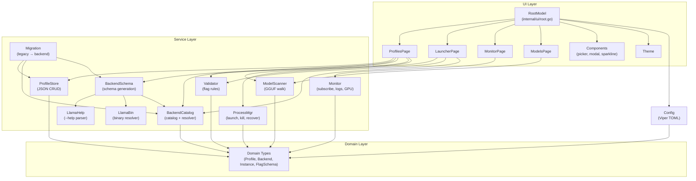

# Architecture — model-loader

**Generated:** 2026-05-10  
**Stack:** Go 1.26.2 + Charmbracelet bubbletea  
**Pattern:** Event-driven TUI with domain-driven service layer

---

## Overview

model-loader is a terminal UI for managing `llama-server` profiles and processes. It is built as a single Go binary with a 5-tab bubbletea application (`tea.Program`) backed by a domain-driven service layer.

The architecture separates concerns into three layers:

| Layer | Responsibility |
|-------|--------------|
| **UI** (`internal/ui/`) | Bubbletea models, pages, components, theme — handles all user interaction |
| **Services** (`internal/service/`) | Business logic: process lifecycle, monitoring, persistence, validation, scanning |
| **Domain** (`internal/domain/`) | Zero-dependency shared types: Profile, Backend, Instance, Model, FlagSchema |

Configuration (`internal/config/`) sits adjacent to the layers and is loaded at boot before the TUI starts.

---

## Functional Areas (from knowledge graph)

| Area | Symbols | Cohesion | Role |
|------|---------|----------|------|
| **Pages** | 41 | 0.98 | 5 TUI tabs (Launcher, Profiles, Monitor, Models, Backends) |
| **Processmgr** | 29 | 0.90 | Spawn, kill, track, recover llama-server processes |
| **Migration** | 27 | 0.80 | One-time legacy binary-path → backend-ID migration |
| **Ui** | 19 | 0.81 | Root model, routing, key handling, boot blocker |
| **Monitor** | 12 | 0.74 | Subscribe to logs, slots, health, GPU metrics |
| **Profilestore** | 12 | 0.74 | CRUD + duplicate profiles as JSON files |
| **Modelscanner** | 12 | 0.97 | Walk filesystem, parse GGUF headers, emit scan events |
| **Components** | 11 | 0.84 | Reusable widgets: picker, modal, sparkline, statusbar |
| **Llamahelp** | 9 | 0.95 | Parse `llama-server --help` into `FlagSchema` |
| **Backendcatalog** | 9 | 0.72 | Multi-backend catalog + schema resolver |

> Knowledge graph: 3,150 symbols, 10,224 relationships, 107 clusters, 273 flows (Go layer only; `llamacpp/` external forks excluded).

---

## Layer Diagram



---

## Key Execution Flows

### 1. Boot Sequence
**Trigger:** `cmd/model-loader/main.go`

```
main()
  → ExpandTilde() on config paths
  → Load AppConfig (Viper TOML, ApplyDefaults)
  → Init FSStore (profiles dir)
  → Init FsSchemaStore (backends/schemas dir)
  → Init BackendCatalog store
  → Init BackendSchema Manager + Register LlamaServerGenerator
  → Run MigrationService (legacy binary path → backend ID)
  → Init ProcessMgr + Reconcile (recover orphaned instances)
  → Build RootModel with all service dependencies
  → tea.NewProgram(rootModel).Run()
```

**Critical:** `Reconcile()` must run before any `Launch`/`Kill` to avoid losing track of background instances that survived a previous TUI exit.

---

### 2. Profile Launch
**Trigger:** User presses `Enter` on LauncherPage (or `L` on ProfilesPage)

```
LauncherPage.launchProfileCmd()
  → Validator.Validate(profile, schema) → Report
    → if blocking errors: show modal, abort
  → BackendCatalog.Resolver.Resolve(profile)
    → load catalog → find backend by ID (or default)
    → llamabin.Resolve(backend.Executable) → absolute path
    → SchemaStore.Load(schemaRef) → FlagSchema
  → ProcessMgr.Launch(profile, mode)
    → BuildArgs(profile) → []string for llama-server CLI
    → canonicalFlag() maps short keys (ngl → n-gpu-layers)
    → if Background: os.StartProcess(detached) + registry.Save()
    → if Foreground: exec.Cmd with TUI log streaming
    → Health check: TCP dial on profile port
  → If success: SwitchToMonitorMsg sent to root
```

**Constraint:** Only one foreground instance is allowed at a time. Manager enforces this.

---

### 3. Monitor Subscription
**Trigger:** User presses `Enter` on an instance in MonitorPage

```
MonitorPage.Update → MonitorSelectPIDMsg
  → Monitor.Subscribe(config)
    → Spawn 6 goroutines:
      1. Log tailer (fsnotify on <pid>.log)
      2. Log pump (non-blocking send to event channel)
      3. Slots poller (GET /health + GET /slots)
      4. Slots pump
      5. GPU poller (nvidia-smi fallback; gopsutil is no-op)
      6. Metrics ticker (rolling window: tokens/s, requests/s)
    → Unified 256-buffered event channel
    → Cancel func waits on sync.WaitGroup before close
  → MonitorPage subState.Apply(event) updates local model
  → renderSubViewBody() shows Logs / Slots / Metrics
```

**Constraint:** All pollers drop events on backpressure (non-blocking send with `default`). Channel must not be blocked by consumers.

---

### 4. Model Scan
**Trigger:** User opens Models tab (or Init in ModelPicker)

```
ModelsPage.Init → startScanCmd
  → ModelScanner.Scan(ctx, searchPaths)
    → Walk each path recursively
    → For each .gguf file:
      → Open file, read magic + header + KV pairs
      → Extract general.parameter_count, general.size_label
      → Fallback: parse quant/params from filename regex
      → Emit ScanEventFile on buffered channel (cap 64)
    → Emit ScanEventProgress per directory
    → Emit ScanEventDone on completion
  → ModelsPage Update receives events via tea.Cmd
    → File events: append to table rows
    → Progress events: update status bar
    → Done event: refresh table, show count
```

**Constraint:** Caller must drain the channel until close; otherwise the background goroutine leaks.

---

### 5. Backend Schema Generation
**Trigger:** User presses `Ctrl+B` in Profiles tab to add a new backend

```
ProfilesPage → AddBackendMsg
  → BackendSchema.Manager.AddBackend(ctx, name, executable, kind)
    → domain.Slugify(name) → backend ID
    → If kind == llama-server:
      → LlamaServerGenerator.Generate(backend)
        → If existing schema has source.editable=true: skip (preserve manual edits)
        → llamabin.Resolve(backend.Executable) → path
        → llamahelp.NewExecParserFor(path).Parse(ctx)
          → Runs llama-server --help with 10s timeout
          → Text parser: section regex → flag regex → type inference → FlagSchema
          → Fallback: llamahelp.EmbeddedSchema() if binary not found
        → FlagSchemaToBackend(fs, kind, id, source) → BackendValidationSchema
        → SchemaStore.Save(ref, schema) → JSON on disk
    → Upsert backend into catalog.Backends
    → If first backend: set DefaultBackendID
    → CatalogStore.Save(catalog)
  → UI refresh: reload backend list
```

**Constraint:** Schema is generated *before* catalog is saved so an invalid binary does not create a broken catalog entry. If catalog save fails after schema generation, the schema is left as an orphan (harmless).

---

## Data Flow Summary

| Flow | Entry | Services | Output |
|------|-------|----------|--------|
| Boot | `main.go` | Config → Stores → Migration → ProcessMgr.Reconcile | TUI running |
| Launch | `LauncherPage` | Validator → BackendCatalog → ProcessMgr | llama-server process |
| Monitor | `MonitorPage` | Monitor.Subscribe → 6 goroutines | Live logs/slots/GPU/metrics |
| Scan | `ModelsPage` | ModelScanner.Scan → channel | Table of `.gguf` files |
| Schema | `ProfilesPage` | BackendSchema → LlamaHelp → SchemaStore | `schemas/<id>.json` |

---

## File Organization

```
cmd/model-loader/
  main.go              # Boot sequence: config → stores → migration → TUI

internal/config/
  config.go            # Viper TOML loader, path expansion, defaults

internal/domain/
  profile.go           # Profile, LaunchConfig, ProfileMeta, Slugify
  backend.go           # Backend, BackendCatalog, BackendKind, BackendMeta
  flag_schema.go       # FlagSchema, FlagSpec, FlagType, Lookup
  instance.go          # Instance (running process snapshot)
  model.go             # ModelFile (GGUF metadata holder)
  backend_schema.go    # BackendValidationSchema, SchemaSource, conversion

internal/service/
  backendcatalog/      # Catalog + schema store interfaces, resolver, default catalog
  backendschema/       # Manager (CRUD), LlamaServerGenerator
  llamabin/            # Binary resolution: PATH lookup, validation
  llamahelp/           # --help parser (embedded + exec), flag type inference
  migration/           # Legacy binary path → backend ID migration
  modelscanner/        # Filesystem walk + GGUF binary parsing
  monitor/             # Subscribe with 6 goroutines, event fan-in
  processmgr/          # Launch, kill, list, health check, log tail, recovery
  profilestore/        # JSON CRUD per profile, atomic writes, port deconflict
  validator/           # FlagSchema validation: type, extra-args, existence

internal/ui/
  root.go              # RootModel: tab routing, global shortcuts, boot blocker
  pages/
    profiles.go        # Profile CRUD master-detail with huh forms
    launcher.go        # Profile selection, validation, launch orchestration
    monitor.go         # Live instance monitoring: logs, slots, metrics
    models.go          # GGUF model browser with streaming scanner
  components/
    picker.go          # Streaming model picker (bubbletea Model)
    modal.go           # Centered lipgloss box (render-only)
    sparkline.go       # ASCII sparkline (pure function)
    statusbar.go       # Level-based colored status (render-only)
  theme/
    theme.go           # Lipgloss styles, color palette
```

---

## Cross-Cutting Concerns

- **Instance Recovery:** Background `llama-server` processes survive TUI exit. `processmgr.Reconcile()` at boot restores the in-memory registry from `instances.json` by checking live PIDs and dropping zombies.
- **Golden Tests:** `llamahelp` and other packages use golden file fixtures in `testdata/`. Update with `go test ./... -update`. Never edit `.golden.json` by hand.
- **TUI Input Gate:** Global shortcuts in `RootModel.Update` that consume printable runes MUST check `activePageCapturesInput()`. Pages with `huh` forms / pickers / modals implement `InputCapture.IsCapturingInput() bool` returning `true`.
- **Editable Schema Protection:** If `schema.source.editable == true`, `LlamaServerGenerator.Generate()` skips regeneration to preserve user edits.

---

## Anti-Patterns (Architecture Level)

1. **Do not run `llama-server` manually** while the TUI is managing instances — the registry will desync.
2. **Do not add `internal/service/` imports to `internal/ui/components/`** — redeclare minimal interfaces locally to keep the UI layer decoupled.
3. **Do not block the Monitor event channel** — it uses non-blocking sends; blocking consumers will silently drop events.
4. **Do not leave a ModelScanner channel undrained** — the walk goroutine leaks.
5. **Do not create backends without generating schemas first** — `AddBackend` generates schema before catalog save.

---

## Re-generating

```bash
npx gitnexus analyze --force    # reindex this repo
```

The graph is current as of the latest commit on branch `main`.
