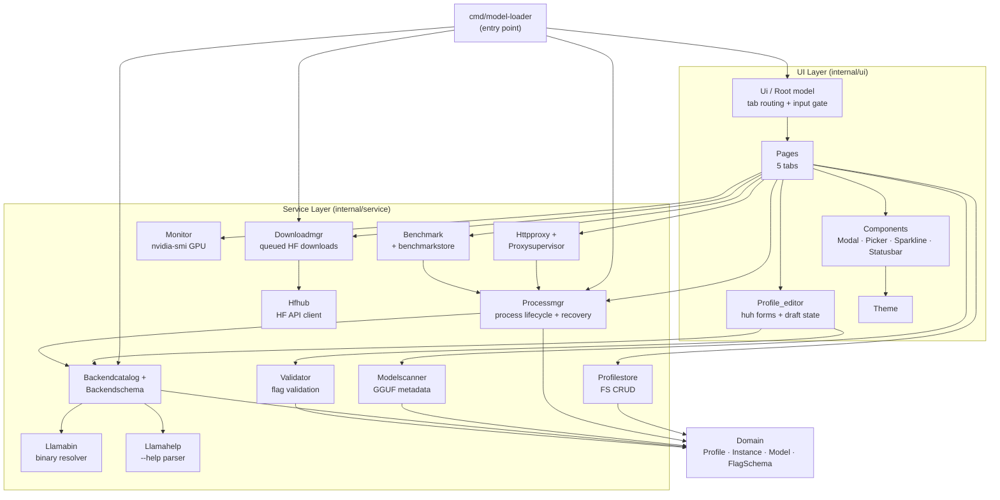

# Architecture

**Project:** model-loader  
**Generated:** 2026-05-21 from GitNexus knowledge graph  
**Stats:** 268 files · 7158 symbols · 25373 relationships · 300 execution flows  
**Indexed commit:** f32c804

## Overview

`model-loader` is a terminal UI (TUI) application for managing llama.cpp profiles and `llama-server` processes. Built with **Go 1.26.2** and the **Charmbracelet bubbletea** stack, it provides a 5-tab interface for model discovery, profile editing, server lifecycle management, benchmarking, and an OpenAI-compatible HTTP proxy.

The codebase follows a domain-driven layout: a thin TUI layer (`internal/ui/`) drives focused services (`internal/service/`) over a shared domain model (`internal/domain/`). Background `llama-server` processes intentionally survive TUI exit and are recovered at boot from persisted state in `~/.local/state/model-loader/instances.json`.

## Functional Areas

GitNexus clusters the codebase into 27 functional modules. The most significant by symbol count and cohesion:

| Module | Symbols | Cohesion | Responsibility |
|--------|---------|----------|----------------|
| **Pages** | 432 | 72% | 5 TUI tabs (Profiles, Models, Server, Benchmark, Downloads) + page logic |
| **Components** | 257 | 80% | Reusable UI widgets: Help, Modal, Picker, Sparkline, Statusbar |
| **Profile_editor** | 144 | 77% | `huh`-based profile editing with essentials registry + draft state machine |
| **Processmgr** | 107 | 79% | `llama-server` process lifecycle + instance recovery |
| **Profilestore** | 81 | 82% | FS-based profile CRUD |
| **Ui** | 72 | 84% | Root model, tab orchestration, global input routing |
| **Backendschema** | 63 | 81% | Schema generation orchestrator across all backend kinds |
| **Downloadmgr** | 61 | 83% | HuggingFace file downloader with progress events + state |
| **Benchmark** | 51 | 86% | SWE-bench Lite + long-context needle probe engine |
| **Monitor** | 46 | 88% | GPU metrics via `nvidia-smi` |
| **Httpproxy** | 42 | 88% | OpenAI-shaped reverse proxy |
| **Modelscanner** | 34 | 88% | GGUF model metadata extraction |
| **Llamahelp** | 31 | 89% | `llama-server --help` parser + embedded schema (v7376) |
| **Validator** | 24 | 80% | Flag validation rules |
| **Hfhub** | 21 | 74% | HuggingFace Hub API client (search, file listing) |
| **Backendcatalog** | 20 | 67% | Multi-backend catalog + binary resolver |
| **Llamabin** | 19 | 91% | Binary path resolution (PATH + Python fallback) |
| **Proxysupervisor** | 14 | 98% | HTTP proxy lifecycle state machine |
| **Benchmarkstore** | 14 | 82% | Benchmark run persistence (1 JSON per run) |

Plus smaller modules: Config, Domain, Log, Migration, Metricsstore, Playground, SGLang/vLLM help embeds, and an internal `fsx` atomic-write helper.

## Key Execution Flows

The graph holds 300 flows. The top 5 by step count and cross-community impact:

### 1. GGUF Model Scanning — `Scan → GgufHeader` (7 steps)

Cross-community flow spanning **Modelscanner** communities. Reads GGUF metadata from disk into the model catalog.

```
Scan (modelscanner/scanner.go)
  → scanRoot
    → buildModelFile
      → readMetaFromFile
        → readGGUFMeta (gguf.go)
          → readGGUFHeader
            → ggufHeader
```

### 2. Backend Binary Probing — `Probe → SplitCommandLine` (7 steps)

Intra-community flow inside **Backendcatalog** + **Llamabin**. Resolves the correct backend executable at runtime.

```
Probe (backendcatalog/probe.go)
  → probeOne
    → resolveExecutable (resolver.go)
      → ResolveCommandWithPythonFallback (llamabin/resolver.go)
        → Resolve
          → splitCommand
            → splitCommandLine
```

### 3. Backend Binary Resolution — `Resolve → CheckExecutable` (6 steps)

Intra-community flow for backend catalog binary resolution. Supports PATH lookup and Python-module fallback.

```
Resolve (backendcatalog/resolver.go)
  → resolveExecutable
    → ResolveCommandWithPythonFallback (llamabin/resolver.go)
      → Resolve
        → resolveInPATH
          → checkExecutable
```

### 4. TUI Startup & Download Recovery — `RunTUI → DownloadRecord` (5 steps)

Cross-community flow connecting **CLI entry** to **Downloadmgr**. Reconciles persisted download state when the TUI boots.

```
runTUI (cmd/model-loader/main.go)
  → Reconcile (downloadmgr/manager.go)
    → ListRecords (downloadmgr/state.go)
      → LoadRecord
        → DownloadRecord
```

### 5. Server Launch Bootstrap — `RunServe → ApplyDefaults` (5 steps)

Cross-community flow initializing the CLI `serve` subcommand.

```
runServe (cmd/model-loader/main.go)
  → bootstrap (cmd/model-loader/bootstrap.go)
    → Load (internal/config/config.go)
      → LoadFrom
        → applyDefaults
```

### Bonus: Schema Generation — `Generate → FlagSpec` (5 steps)

Cross-community flow that produces flag schemas from `--help` output at runtime.

```
Generate (backendschema/generator.go)
  → Parse (llamahelp/exec_parser.go)
    → ParseHelp (llamahelp/parser.go)
      → parseFlagLine
        → FlagSpec (domain/flag_schema.go)
```

## Architecture Diagram



## Notable Design Decisions

- **Process survival:** background `llama-server` processes are intentionally orphaned on TUI exit; `processmgr.Reconcile` restores them from `~/.local/state/model-loader/instances.json` at boot.
- **Input routing:** every global shortcut consuming a printable rune must be gated behind `activePageCapturesInput()`; pages with active `huh` forms / pickers implement `InputCapture`. See `CLAUDE.md` → TUI INPUT ROUTING RULES.
- **Embedded schema:** the `llama-server --help` schema is pinned to build `v7376 (380b4c9)`; parsed at runtime if the binary is present, falling back to the embedded copy.
- **Schema-driven profiles:** Profiles are schema-aware. A `SchemaBuilder` constructs structured `FlagSchema` per backend kind; the profile editor maps drafts via `ApplyToWithSchema`/`ToProfileWithSchema`, and the validator runs `Validate(profile, FlagSchema, BackendKind)` so flag checks adapt to the selected backend.
- **Essentials registry is curated UX:** `essentialFields` in `profile_editor/essentials.go` is a hand-picked list of per-backend flags — not a generic form abstraction.
- **Profile schema is canonical:** `docs/profile-schema.json` is the authoritative JSON Schema for the persisted profile file format. Any change to `domain.Profile` must mirror it there.
- **Config / state paths:** config at `~/.config/model-loader/config.toml`, profiles at `~/.config/model-loader/profiles/`, backends at `~/.config/model-loader/backends/`, state at `~/.local/state/model-loader/`.
