# Architecture — model-loader

**Generated:** 2026-05-17
**Stack:** Go 1.26.2 + Charmbracelet bubbletea
**Pattern:** Event-driven TUI with domain-driven service layer
**Source:** GitNexus knowledge graph — `175 files, 4921 nodes, 17900 edges, 184 communities, 300 processes`

---

## Overview

`model-loader` is a terminal UI for managing `llama-server` (and sglang / vLLM) profiles, processes, and models. A single Go binary runs a 6-tab `tea.Program` backed by a domain-driven service layer. Background `llama-server` processes survive TUI exit and are reconciled at next boot.

Three layers plus storage:

| Layer | Responsibility |
|-------|--------------|
| **UI** (`internal/ui/`) | Bubbletea root + pages + components + theme — handles all user interaction |
| **Services** (`internal/service/`) | Business logic: process lifecycle, monitoring, persistence, schema, scanning, HF downloads, HTTP proxy |
| **Domain** (`internal/domain/`) | Zero-dependency shared types: Profile, Backend, Instance, Model, FlagSchema |

Config (`internal/config/`) loads first; the TUI does not start until catalog, schemas, migrations, and process reconciliation finish.

---

## Functional Areas (knowledge graph communities)

| Area | Symbols (total across sub-communities) | Role |
|------|---------|------|
| **Pages** | 367 | TUI tabs: launcher, profiles, monitor, models, backends, proxy |
| **Components** | 207 | Reusable widgets: picker, modal, sparkline, statusbar, HF pickers, flash |
| **Processmgr** | 92 | Spawn/kill/track/recover llama-server processes; reconcile across TUI restarts |
| **Profile_editor** | 67 | Inline `huh`-form editor; draft state machine |
| **Ui** | 58 | Root model, routing, key gating, boot blocker |
| **Monitor** | 46 | Subscribe to logs / slots / health / GPU (nvidia-smi) |
| **Backendschema** | 46 | Schema generation orchestrator per backend kind (llama/sglang/vllm) |
| **Httpproxy** | 44 | Reverse proxy in front of llama-server (model swap, header extraction) |
| **Llamahelp** | 33 | Parse `llama-server --help` → `FlagSchema`; embedded fallback |
| **Downloadmgr** | 32 | Queued HuggingFace file downloader with cancel + progress events |
| **Modelscanner** | 32 | Walk filesystem, parse GGUF headers, emit scan events |
| **Profilestore** | 30 | CRUD profiles as JSON with atomic writes |
| **Backendcatalog** | 26 | Multi-backend catalog + executable / schema resolver |
| **Hfhub** | 21 | HuggingFace Hub API client (model search, file listing) |
| **Llamabin** | 16 | Resolve binary path (PATH lookup, Python-fallback for sglang/vllm) |
| **Proxysupervisor** | 14 | State machine driving httpproxy lifecycle |
| **Validator** | 14 | FlagSchema validation rules engine |
| **Config** | 7 | Viper TOML loader + defaults |
| **Migration** | 6 | One-time legacy `binary` → backend ID migration |
| **Filter** | 6 | Generic list/table filter helper |
| **Model-loader** | 7 | Entry point + bootstrap |
| **Domain** | 2 | Core domain structs |

> Symbol counts aggregate sub-communities of the same heuristic label. Pages and Components fragment into many small clusters (one per tab / widget family).

---

## Layer Diagram

```mermaid
graph TD
    subgraph "UI Layer"
        Root["RootModel<br/>(internal/ui/root.go)"]
        Launcher["LauncherPage"]
        Profiles["ProfilesPage"]
        MonitorPg["MonitorPage"]
        ModelsPg["ModelsPage"]
        BackendsPg["BackendsPage"]
        ProxyPg["ProxyPage"]
        ProfileEditor["ProfileEditor<br/>(huh draft state)"]
        Components["Components<br/>(picker, modal, sparkline,<br/>statusbar, HF pickers, flash)"]
    end

    subgraph "Service Layer"
        ProcessMgr["ProcessMgr<br/>(launch/kill/recover)"]
        MonitorSvc["Monitor<br/>(logs/slots/GPU)"]
        DownloadMgr["DownloadMgr<br/>(HF queue + cancel)"]
        ModelScanner["ModelScanner<br/>(GGUF walk)"]
        HfHub["HfHub<br/>(HF API client)"]
        ProfileStore["ProfileStore<br/>(JSON CRUD)"]
        BackendCatalog["BackendCatalog<br/>(catalog + resolver)"]
        BackendSchema["BackendSchema<br/>(schema generation)"]
        LlamaHelp["LlamaHelp<br/>(--help parser)"]
        LlamaBin["LlamaBin<br/>(binary resolver)"]
        Validator["Validator<br/>(flag rules)"]
        HttpProxy["HttpProxy<br/>(reverse proxy + swap)"]
        ProxySup["ProxySupervisor<br/>(state machine)"]
        Migration["Migration<br/>(legacy → backend ID)"]
    end

    subgraph "Domain Layer"
        Domain["Domain Types<br/>(Profile, Backend, Instance,<br/>Model, FlagSchema)"]
    end

    Config["Config<br/>(Viper TOML)"]

    Root --> Launcher & Profiles & MonitorPg & ModelsPg & BackendsPg & ProxyPg
    Root --> ProfileEditor
    Root --> Components
    Root --> Config

    Launcher --> ProcessMgr
    Launcher --> Validator
    Launcher --> BackendCatalog

    Profiles --> ProfileStore
    Profiles --> BackendCatalog
    Profiles --> Validator
    Profiles --> ModelScanner

    ProfileEditor --> ProfileStore
    ProfileEditor --> Validator
    ProfileEditor --> BackendCatalog
    ProfileEditor --> DownloadMgr

    ModelsPg --> ModelScanner
    ModelsPg --> HfHub
    ModelsPg --> DownloadMgr

    MonitorPg --> MonitorSvc
    BackendsPg --> BackendCatalog
    BackendsPg --> BackendSchema
    ProxyPg --> ProxySup
    ProxyPg --> HttpProxy

    ProxySup --> HttpProxy
    ProxySup --> ProcessMgr

    DownloadMgr --> HfHub

    BackendSchema --> LlamaHelp
    BackendSchema --> LlamaBin
    BackendSchema --> BackendCatalog

    BackendCatalog --> LlamaBin

    Migration --> ProfileStore
    Migration --> BackendCatalog
    Migration --> BackendSchema

    ProcessMgr --> Domain
    MonitorSvc --> Domain
    DownloadMgr --> Domain
    ModelScanner --> Domain
    ProfileStore --> Domain
    BackendCatalog --> Domain
    BackendSchema --> Domain
    Validator --> Domain
    HttpProxy --> Domain
    ProxySup --> Domain
    Config --> Domain
```



---

## Key Execution Flows

### 1. Boot Sequence (`Main → DefaultConfigPath`)
**Trigger:** binary launch

| Step | Symbol | File |
|------|--------|------|
| 1 | `main` | `cmd/model-loader/main.go` |
| 2 | `runServe` | `cmd/model-loader/main.go` |
| 3 | `bootstrap` | `cmd/model-loader/bootstrap.go` |
| 4 | `Load` | `internal/config/config.go` |
| 5 | `DefaultConfigPath` | `internal/config/config.go` |

`bootstrap` wires the full dependency graph: Config → BackendCatalog → BackendSchema (registers llama/sglang/vllm generators) → Migration → ProfileStore → ModelScanner → Monitor → ProcessMgr (with `Reconcile`) → DownloadMgr → HfHub → Validator → HttpProxy → ProxySupervisor → RootModel → `tea.NewProgram(rootModel).Run()`.

**Constraint:** `Reconcile()` must run before any `Launch` or `Kill` so orphaned background `llama-server` processes are re-registered from `instances.json`.

---

### 2. GGUF Model Scan (`Scan → GgufHeader`)
**Trigger:** ModelsPage `Init` or picker open in profile editor

| Step | Symbol | File |
|------|--------|------|
| 1 | `Scan` | `internal/service/modelscanner/scanner.go` |
| 2 | `scanRoot` | `internal/service/modelscanner/scanner.go` |
| 3 | `buildModelFile` | `internal/service/modelscanner/scanner.go` |
| 4 | `readParamsFromFile` | `internal/service/modelscanner/scanner.go` |
| 5 | `readGGUFParams` | `internal/service/modelscanner/gguf.go` |
| 6 | `readGGUFHeader` | `internal/service/modelscanner/gguf.go` |
| 7 | `ggufHeader` | `internal/service/modelscanner/gguf.go` |

Walks search paths, opens each `.gguf` file, reads magic + header + KV pairs to extract `parameter_count` and `size_label`. Falls back to filename quant/size regex if KV missing. Emits `ScanEventFile`/`Progress`/`Done` on a buffered channel (cap 64).

**Constraint:** Consumer MUST drain channel until close, else the scan goroutine leaks.

---

### 3. Binary Probe & Resolution (`Probe → CheckExecutable`)
**Trigger:** BackendCatalog add/edit or schema regen

| Step | Symbol | File |
|------|--------|------|
| 1 | `Probe` | `internal/service/backendcatalog/probe.go` |
| 2 | `probeOne` | `internal/service/backendcatalog/probe.go` |
| 3 | `resolveExecutable` | `internal/service/backendcatalog/resolver.go` |
| 4 | `ResolveCommandWithPythonFallback` | `internal/service/llamabin/resolver.go` |
| 5 | `Resolve` | `internal/service/llamabin/resolver.go` |
| 6 | `resolveInPATH` | `internal/service/llamabin/resolver.go` |
| 7 | `checkExecutable` | `internal/service/llamabin/resolver.go` |

`probeOne` looks up an executable, runs `--help` (or `python -m <module> --help` for sglang/vllm), and feeds the output to `llamahelp.Parse`. The Python fallback resolver lets backends shipped as Python modules be probed without a binary symlink.

---

### 4. HuggingFace Download — Cancel Path (`Cancel → Draft`)
**Trigger:** user cancels active HF download from profile editor

| Step | Symbol | File |
|------|--------|------|
| 1 | `Cancel` | `internal/service/downloadmgr/manager.go` |
| 2 | `startNextLocked` | `internal/service/downloadmgr/manager.go` |
| 3 | `startLocked` | `internal/service/downloadmgr/manager.go` |
| 4 | `runDownload` | `internal/service/downloadmgr/manager.go` |
| 5 | `download` | `internal/service/downloadmgr/manager.go` |
| 6 | `Close` | `internal/service/downloadmgr/manager.go` |
| 7 | `close` | `internal/ui/pages/profile_editor/editor.go` |
| 8 | `Draft` | `internal/ui/pages/profile_editor/draft.go` |

DownloadMgr keeps a FIFO queue of HF file downloads. `Cancel` terminates the in-flight request, broadcasts a `DownloadEvent`, and `startNextLocked` immediately promotes the next queued item. The profile-editor draft state listens for the broadcast and re-renders without blocking.

**Constraint:** Cancellation is via `context.Context`; the writer side aborts on context error and the broadcast pump is non-blocking. Editor must keep its event subscription alive across cancel.

---

### 5. UI Picker Scan Pump (`Update → PickerScanClosedMsg`)
**Trigger:** profile editor opens the GGUF model picker

| Step | Symbol | File |
|------|--------|------|
| 1 | `Update` | `internal/ui/pages/profiles.go` |
| 2 | `handlePickerScan` | `internal/ui/pages/profiles.go` |
| 3 | `updatePicker` | `internal/ui/pages/profiles.go` |
| 4 | `Update` | `internal/ui/components/picker.go` |
| 5 | `handleScanStarted` | `internal/ui/components/picker.go` |
| 6 | `pickerWaitForEvent` | `internal/ui/components/picker.go` |
| 7 | `PickerScanClosedMsg` | `internal/ui/components/picker.go` |

The picker subscribes to `ModelScanner.Scan`'s event channel and converts each event into a `tea.Msg`. `pickerWaitForEvent` is the long-poll cmd that re-arms itself until `ScanEventDone` is received and emits `PickerScanClosedMsg` so the host page can refresh.

**Constraint:** Page hosting the picker MUST implement `InputCapture.IsCapturingInput() → true` while picker is open, else `RootModel`'s global shortcut gate eats printable keystrokes.

---

## File Map

```
cmd/model-loader/
  main.go                          # CLI entry: parse flags, runServe
  bootstrap.go                     # Wire services + RootModel
  scripts/print_args.go            # Dev tool: print CLI args for a profile

internal/config/
  config.go                        # Viper TOML loader + defaults + path expansion

internal/domain/
  profile.go                       # Profile, LaunchConfig, ProfileMeta
  backend.go / backend_schema.go   # Backend, BackendCatalog, BackendKind, FlagSchema
  instance.go                      # RunningInstance, ExitedInstance, LogLine
  model.go                         # ModelFile, ScanEvent
  flag_schema.go                   # FlagSchema, FlagSpec
  flags.go / modelpath.go          # Flag parsing, model path normalization

internal/service/processmgr/
  manager.go                       # Launch, Kill, List, WaitHealthy (16 sub-symbols)
  recover.go                       # Reconcile orphaned instances at boot
  registry.go                      # Persist running instances to instances.json
  args.go / shellsplit.go          # BuildArgs, canonicalFlag, shell tokenizer
  exit_info.go                     # Capture stderr tail
  history.go                       # Persisted exit history
  liveness.go                      # TCP health check
  internal/fsx/atomic_write.go     # Temp-file + rename helper

internal/service/monitor/
  subscribe.go                     # 6-goroutine event pump (logs/slots/GPU/metrics)
  logs.go                          # fsnotify log tailer
  slots.go                         # GET /health + GET /slots poller
  gpu.go                           # nvidia-smi parser (gopsutil no-op fallback)
  metrics.go                       # Rolling tokens/s, requests/s
  ring.go                          # Fixed-capacity log line buffer

internal/service/profilestore/
  fs_store.go                      # JSON CRUD with atomic writes
  export.go                        # Export/import bundle

internal/service/backendcatalog/
  fs_store.go                      # Catalog + schema JSON persistence
  resolver.go                      # Resolve profile → backend → executable + schema
  probe.go                         # Detect backend kind from --help output
  default.go                       # DefaultCatalog for first-run

internal/service/backendschema/
  manager.go                       # AddBackend orchestrator (8 sub-symbols)
  generator.go                     # Generator interface
  embedded_generator.go            # Compile-time embedded fallback
  sglang_generator.go              # sglang schema generator
  vllm_generator.go                # vLLM schema generator

internal/service/llamahelp/
  parser.go                        # Text regex parser for --help output
  exec_parser.go                   # Runs binary with --help and feeds parser
  embedded.go                      # Compile-time schema pinned to v7376

internal/service/llamabin/
  resolver.go                      # PATH lookup + Python-fallback resolver

internal/service/modelscanner/
  scanner.go                       # Walk + ScanEvent emission
  gguf.go                          # Binary GGUF header parser
  quant.go                         # Quantization regex from filename

internal/service/hfhub/
  client.go                        # HF Hub API client (search, list files)

internal/service/downloadmgr/
  manager.go                       # Queued download manager with cancel (14 sub-symbols)
  pathing.go                       # Target path resolution per profile

internal/service/httpproxy/
  server.go                        # HTTP listener
  handler.go                       # Request handler + reverse proxy
  proxy.go                         # Proxy core
  extract.go                       # Header / model-name extraction
  errors.go                        # Proxy-specific error types

internal/service/proxysupervisor/
  supervisor.go                    # State machine driving httpproxy
  state.go                         # State enum + transitions

internal/service/validator/
  validator.go                     # Validator interface
  rules.go                         # FlagSchema validation rules

internal/service/migration/
  migration.go                     # Legacy binary path → backend ID migration

internal/ui/
  root.go                          # RootModel: tab routing, global keys, boot blocker
  theme/                           # Lipgloss palette

internal/ui/pages/
  launcher.go                      # Tab 1: select + launch profile
  profiles.go                      # Tab 2: profile CRUD master list
  monitor.go                       # Tab 3: live GPU/logs/slots per instance
  models.go                        # Tab 4: GGUF + HF model browser
  backends.go                      # Tab 5: backend catalog management
  proxy.go                         # Tab 6: proxy supervisor controls
  messages.go                      # Cross-tab tea.Msg definitions
  profile_editor/
    editor.go                      # Inline huh form
    draft.go                       # Draft profile state machine

internal/ui/components/
  picker.go                        # Model file picker
  modal.go / confirm.go            # Dialogs
  help.go                          # Help overlay
  flash.go                         # Ephemeral status flash
  sparkline.go / statusbar.go      # Chart + bottom bar
  hf_search_picker.go              # HF model search overlay
  hf_file_picker.go                # HF file picker for downloads
```

---

## Design Decisions

1. **Background processes survive TUI exit.** `ProcessMgr` sets `Setsid` + persists to `instances.json`. `Reconcile()` re-registers them at next boot. Do not `Kill` on TUI shutdown.

2. **Domain layer has zero deps.** Every service depends only on `internal/domain` and stdlib; keeps dep graph shallow and tests isolated.

3. **Schema generated before catalog save.** `BackendSchema.Manager.AddBackend` writes schema JSON first, then upserts the catalog. Broken binary cannot leave a half-valid catalog entry. Orphan schema is harmless.

4. **Embedded llama-server schema fallback.** `llamahelp.EmbeddedSchema()` pinned to build `v7376 (380b4c9)` so the TUI is usable even when the binary is missing or `--help` fails.

5. **Non-blocking monitor pump.** 6 goroutines push to a 256-buffered channel using non-blocking sends; consumers must keep up. `Cancel` waits on `sync.WaitGroup` before closing.

6. **Atomic FS writes.** Profiles, catalog, schemas, and `instances.json` all go through `internal/service/internal/fsx.AtomicWrite` (temp-file + rename) to survive crashes mid-write.

7. **Input capture contract.** Pages with active huh forms / pickers / inline modals MUST implement `InputCapture.IsCapturingInput() → true`. `RootModel` gates every printable-rune global shortcut behind `activePageCapturesInput()`. Only `ctrl+c` bypasses.

8. **HF downloads are queued, cancellable, broadcast.** `DownloadMgr` runs one transfer at a time (FIFO), supports `Cancel`, and broadcasts `DownloadEvent`s. Profile-editor draft subscribes for live progress; cancel triggers immediate next-item promotion.

9. **HTTP proxy + supervisor decoupled.** `httpproxy` is a stateless reverse proxy; `proxysupervisor` is the state machine that decides when to start/stop it and which backend to forward to. UI talks only to the supervisor.

10. **Storage paths follow XDG.**
    - Config: `~/.config/model-loader/config.toml`
    - State (instances): `~/.local/state/model-loader/instances.json`
    - Profiles: `~/.local/share/model-loader/profiles/`
    - Backends/schemas: `~/.local/share/model-loader/backends/`

---

*Document generated via GitNexus knowledge graph analysis — 2026-05-17.*
