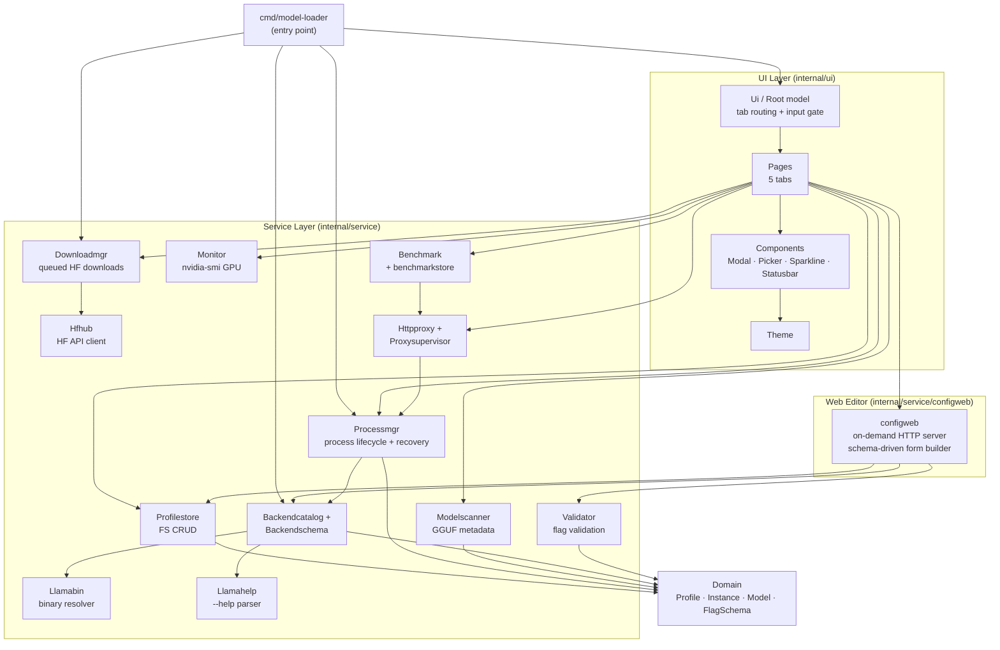

# Architecture

**Project:** model-loader  
**Generated:** 2026-05-23 from GitNexus knowledge graph  
**Stats:** 309 files · 7,414 symbols · 30,635 relationships · 300 execution flows  
**Indexed commit:** defda2f

## Overview

`model-loader` is a terminal UI (TUI) application for managing llama.cpp profiles and `llama-server` processes. Built with **Go 1.26.2** and the **Charmbracelet bubbletea** stack, it provides a 5-tab interface for model discovery, profile editing, server lifecycle management, benchmarking, and an OpenAI-compatible HTTP proxy.

The codebase follows a domain-driven layout: a thin TUI layer (`internal/ui/`) drives focused services (`internal/service/`) over a shared domain model (`internal/domain/`). Background `llama-server` processes intentionally survive TUI exit and are recovered at boot from persisted state in `~/.local/state/model-loader/instances.json`.

## Functional Areas

GitNexus clusters the codebase into 27 functional modules. The most significant by symbol count and cohesion:

| Module | Symbols | Cohesion | Responsibility |
|--------|---------|----------|----------------|
| **Pages** | 456 | 73% | 5 TUI tabs (Profiles, Models, Backends, Server, Benchmark) + page logic |
| **Components** | 251 | 82% | Reusable UI widgets: Help, Modal, Picker, Sparkline, Statusbar |
| **Cli** | 196 | 71% | Subcommand dispatch, argument parsing, TUI/CLI dual entry |
| **Benchmark** | 179 | 81% | SWE-bench Lite + long-context needle probe engine |
| **Processmgr** | 119 | 81% | `llama-server` process lifecycle + instance recovery |
| **Backendschema** | 117 | 84% | Schema generation orchestrator across all backend kinds |
| **Profilestore** | 81 | 82% | FS-based profile CRUD |
| **Ui** | 69 | 83% | Root model, tab orchestration, global input routing |
| **Downloadmgr** | 62 | 84% | HuggingFace file downloader with progress events + state |
| **Configweb** | 60 | 78% | On-demand HTTP server for web-based profile editing |
| **Monitor** | 46 | 90% | GPU metrics via `nvidia-smi` |
| **Httpproxy** | 44 | 89% | OpenAI-shaped reverse proxy |
| **Validator** | 39 | 83% | Flag validation rules + cross-field rule engine |
| **Modelscanner** | 35 | 89% | GGUF model metadata extraction |
| **Llamahelp** | 31 | 89% | `llama-server --help` parser + embedded schema (v7376) |
| **Domain** | 24 | 70% | Shared types: Profile, Instance, Model, BackendValidationSchema |
| **Hfhub** | 21 | 74% | HuggingFace Hub API client (search, file listing) |
| **Backendcatalog** | 16 | 76% | Multi-backend catalog + binary resolver |
| **Proxysupervisor** | 14 | 98% | HTTP proxy lifecycle state machine |
| **Llamabin** | 12 | 76% | Binary path resolution (PATH + Python fallback) |

Plus smaller modules: Config, Log, Migration, Metricsstore, Playground, SGLang/vLLM/DFlash/buun help embeds, and internal `fsx` atomic-write helper.

## Key Execution Flows

The graph holds 300 flows. The top 5 by step count and cross-community impact:

### 1. Profile Picker Scan — `Update → PickerScanClosedMsg` (7 steps)

Cross-community flow spanning **Pages** and **Components**. Triggered when a profile scan (e.g., model directory scan) completes. The picker component emits a `PickerScanClosedMsg` after the async scan goroutine finishes.

```
Update (profiles_update.go)
  → handlePickerScan
    → updatePicker (profiles_picker.go)
      → Update (picker.go)
        → handleScanStarted
          → pickerWaitForEvent
            → PickerScanClosedMsg
```

### 2. Download Manager Initialization — `Init → StateFilename` (7 steps)

Intra-community flow inside **Downloadmgr**. Reconciles the download state file on CLI init.

```
init (cli/download.go)
  → RunWorker (worker.go)
    → runDownload
      → streamWithProgress
        → SaveRecord (state.go)
          → StatePath
            → stateFilename
```

### 3. Backend Binary Probing — `Probe → SplitCommandLine` (7 steps)

Cross-community flow connecting **Backendcatalog** and **Llamabin**. Resolves the correct backend executable at runtime with PATH lookup + Python fallback.

```
Probe (backendcatalog/probe.go)
  → probeOne
    → resolveExecutable (resolver.go)
      → ResolveCommandWithPythonFallback (llamabin/resolver.go)
        → Resolve
          → splitCommand
            → splitCommandLine
```

### 4. Benchmark Streaming — `Execute → StreamChunk` (6 steps)

Cross-community flow connecting **Benchmark** and the OpenAI client. Sends chat completion requests to a running backend instance and parses streaming SSE chunks.

```
Execute (benchmark/instructionbench.go)
  → runInstructionBench
    → runInstConsistency
      → Complete (client.go)
        → parseChunk
          → streamChunk
```

### 5. Profile Import — `HandleKey → ProfileExists` (6 steps)

Cross-community flow connecting **Pages** and **Profilestore**. Validates IDs, checks for collisions, and writes imported profiles to disk.

```
handleKey (profiles_update.go)
  → startImportWithPath
    → importBundleCmd (profiles_importexport.go)
      → ImportBundle (profilestore/import.go)
        → nextImportedID
          → profileExists
```

### Bonus: Schema Generation — `Generate → FlagSpec` (5 steps)

Cross-community flow that produces flag schemas from `--help` output at runtime.

```
Generate (backendschema/generator.go)
  → Parse (llamahelp/exec_parser.go)
    → ParseHelp (llamahelp/parser.go)
      → parseFlagLine
        → FlagSpec (domain/flag_schema.go)
```

## Architecture Diagram



## Notable Design Decisions

- **Process survival:** background `llama-server` processes are intentionally orphaned on TUI exit; `processmgr.Reconcile` restores them from `~/.local/state/model-loader/instances.json` at boot.
- **Input routing:** every global shortcut consuming a printable rune must be gated behind `activePageCapturesInput()`; pages with active forms / pickers / modals implement `InputCapture`. See `CLAUDE.md` → TUI INPUT ROUTING RULES.
- **Web profile editor:** Profile create/edit no longer uses an in-TUI `huh` form. The Profiles tab launches an on-demand HTTP server (`configweb`) bound to `127.0.0.1:0`, opens the browser, and shows an "editing in browser..." modal. On save/cancel the server shuts down and the TUI reloads the list.
- **Embedded schema:** the `llama-server --help` schema is pinned to build `v7376 (380b4c9)`; parsed at runtime if the binary is present, falling back to the embedded copy.
- **Schema-driven profiles:** Profiles are schema-aware. A `SchemaBuilder` constructs structured `FlagSchema` per backend kind; the profile editor maps drafts via `ApplyToWithSchema`/`ToProfileWithSchema`, and the validator runs `Validate(profile, FlagSchema, BackendKind)` so flag checks adapt to the selected backend.
- **Essentials seed is curated UX:** `essentialSeed` in `backendschema/presentation.go` is a hand-picked list of per-backend flags — not a generic form abstraction. Do not extend without explicit user request.
- **Profile schema is canonical:** `docs/profile-schema.json` is the authoritative JSON Schema for the persisted profile file format. Any change to `domain.Profile` must mirror it there.
- **Config / state paths:** config at `~/.config/model-loader/config.toml`, profiles at `~/.config/model-loader/profiles/`, backends at `~/.config/model-loader/backends/`, state at `~/.local/state/model-loader/`.
