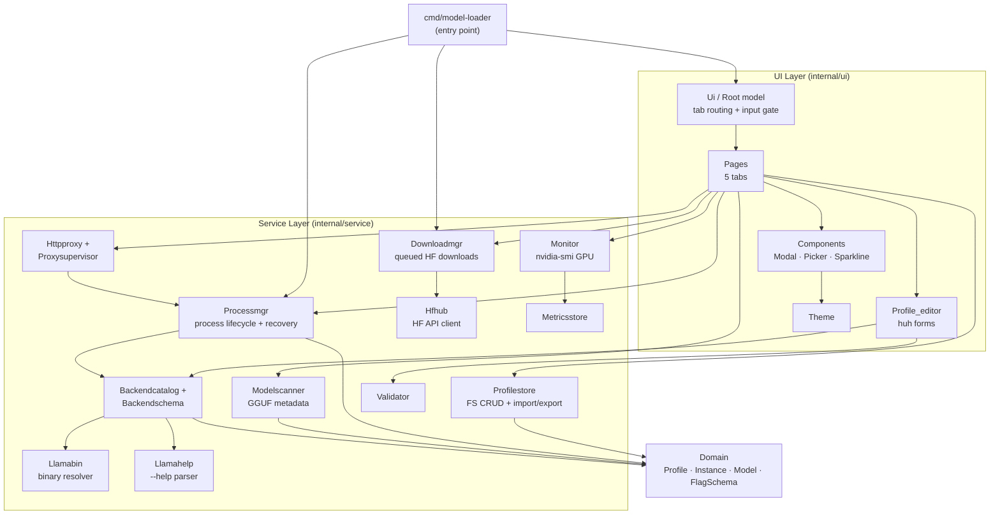

# Architecture

**Project:** model-loader  
**Generated:** 2026-05-21 from GitNexus knowledge graph (fresh index)  
**Stats:** 268 files · 7157 symbols · 25366 relationships · 248 communities · 300 execution flows  
**Indexed commit:** 8b5e8f4

## Overview

`model-loader` is a terminal UI (TUI) application for managing llama.cpp profiles and `llama-server` processes. It is built with **Go 1.26.2** and the **Charmbracelet bubbletea** stack (Elm-style `Update`/`View` loop, `huh` forms).

The codebase follows a domain-driven layout: a thin TUI layer (`internal/ui/`) drives a set of focused services (`internal/service/`) over a shared domain model (`internal/domain/`). Background `llama-server` processes intentionally survive TUI exit and are recovered at boot from persisted state.

## Functional Areas

GitNexus clusters the codebase into 248 communities (functional modules). The most significant by symbol count and cohesion:

| Module | Symbols | Cohesion | Responsibility |
|--------|---------|----------|----------------|
| **Pages** | 373 | 73% | 5 TUI tabs (Profiles, Server, Models, Backends, Benchmark) + routing |
| **Components** | 265 | 80% | Reusable UI widgets: Help, Modal, Picker, Sparkline, Statusbar |
| **Processmgr** | 107 | 79% | `llama-server` process lifecycle + instance recovery |
| **Profile_editor** | 87 | 72% | `huh`-based profile editing with draft state machine |
| **Downloadmgr** | 70 | 79% | HuggingFace file downloader, queued with progress events |
| **Ui** | 69 | 83% | Root model, tab orchestration, global input routing |
| **Profilestore** | 63 | 79% | FS-based profile CRUD + bundle import/export |
| **Backendschema** | 52 | 82% | Schema generation orchestrator across all backend kinds (llama-server, vLLM, SGLang, tabbyapi) |
| **Monitor** | 46 | 88% | GPU metrics via `nvidia-smi` |
| **Httpproxy** | 42 | 87% | OpenAI-shaped reverse proxy |
| **Modelscanner** | 34 | 88% | GGUF model scanning + metadata parsing |
| **Llamahelp** | 33 | 89% | `llama-server --help` parser + embedded schema (v7376) |
| **Hfhub** | 21 | 74% | HuggingFace Hub API client (search, file listing) |
| **Backendcatalog** | 20 | 67% | Multi-backend catalog (kinds: llama-server, vllm, sglang, tabbyapi) + executable resolver |
| **Validator** | 19 | 87% | Schema-aware flag validation rules (`Validate(profile, FlagSchema, BackendKind)`) |
| **Llamabin** | 16 | 93% | Binary path resolution (PATH + Python fallback for `python -m …` launchers) |
| **Proxysupervisor** | 14 | 98% | HTTP proxy lifecycle state machine |
| **Domain** | 14 | 74% | Core types: Profile (`SchemaVersion 3`), Instance, Model, FlagSchema, BackendKind, SchemaBuilder |
| **Theme** | 9 | 71% | TUI styling |
| **Metricsstore** | 9 | 57% | Metrics buffer |

Plus smaller modules: Sizing, Config, Filter, Migration, Benchmarkstore, an internal `fsx` atomic-write helper, and embedded-schema providers (`sglanghelp`, `vllmhelp`). A `Playground` package (OpenAI-compatible chat streaming client) exists but its TUI surface — `internal/ui/components/playground_modal.go` — is currently inert.

## Key Execution Flows

The graph holds 300 flows. The top 5 by step count and cross-community impact:

### 1. Profile Picker Scan — `Update → PickerScanClosedMsg` (7 steps)

Cross-community flow triggered when a user starts a directory scan from the **Profiles** page.

```
ProfilesPage.Update (ui/pages/profiles_update.go)
  → handlePickerScan
    → updatePicker (profiles_picker.go)
      → picker.Update (ui/components/picker.go)
        → handleScanStarted
          → pickerWaitForEvent
            → PickerScanClosedMsg
```

### 2. Backend Binary Probing — `Probe → SplitCommandLine` (7 steps)

Intra-community flow inside **Backendcatalog** + **Llamabin**. Resolves the correct backend executable at runtime.

```
Probe (backendcatalog/probe.go)
  → probeOne
    → resolveExecutable (resolver.go)
      → ResolveCommandWithPythonFallback (llamabin/resolver.go)
        → Resolve
          → splitCommand
            → splitCommandLine
```

### 3. GGUF Model Scanning — `Scan → GgufHeader` (7 steps)

Cross-community flow spanning **Modelscanner** communities. Reads GGUF metadata from disk into the model catalog.

```
Scan (modelscanner/scanner.go)
  → scanRoot
    → buildModelFile
      → readMetaFromFile
        → readGGUFMeta (gguf.go)
          → readGGUFHeader
            → ggufHeader
```

### 4. TUI Boot & Download Polling — `RunTUI → Pending` (6 steps)

Cross-community flow connecting **CLI entry** to **Downloadmgr**. Starts the TUI and background download queue.

```
runTUI (cmd/model-loader/main.go)
  → StartPolling (downloadmgr/manager.go)
    → pollLoop
      → tick
        → reapCompleted
          → pending
```

### 5. Profile Bundle Import — `HandleKey → ProfileExists` (6 steps)

Cross-community flow connecting **Pages** → **Profilestore**. Imports a profile bundle from disk with ID collision check.

```
handleKey (ui/pages/profiles_update.go)
  → startImportWithPath (profiles_importexport.go)
    → importBundleCmd
      → ImportBundle (profilestore/import.go)
        → nextImportedID
          → profileExists
```

## Architecture Diagram



## Notes

- **Process survival:** background `llama-server` processes are intentionally orphaned on TUI exit; `processmgr.Reconcile` restores them from `~/.local/state/model-loader/instances.json` at boot.
- **Input routing:** every global shortcut consuming a printable rune must be gated behind `activePageCapturesInput()`; pages with active `huh` forms / pickers implement `InputCapture`. See `CLAUDE.md` → TUI INPUT ROUTING RULES.
- **Embedded schema:** the `llama-server --help` schema is pinned to build `v7376 (380b4c9)`; parsed at runtime if the binary is present, falling back to the embedded copy. SGLang and vLLM ship embedded schemas only (`sglanghelp`, `vllmhelp`).
- **Schema-driven profiles:** Profiles are now schema-aware (domain `SchemaVersion 3`). A `SchemaBuilder` (domain layer) constructs structured `FlagSchema`/`BackendValidationSchema` per backend kind; the profile editor maps drafts via `ApplyToWithSchema`/`ToProfileWithSchema`, and the validator runs `Validate(profile, FlagSchema, BackendKind)` so flag checks adapt to the selected backend. Profile-store writes go through an atomic-write helper (`internal/service/internal/fsx`).
- **Config / state paths:** config at `~/.config/model-loader/config.toml`, profiles at `~/.config/model-loader/profiles/`, backends at `~/.config/model-loader/backends/`, state at `~/.local/state/model-loader/` (instances + logs under `…/logs/`).
- **Benchmark:** the Benchmark tab + CLI command (`model-loader benchmark`) live inside `Pages` / `Services` communities; they reuse the profile-store and process-manager machinery rather than forming separate top-level clusters. The engine (`internal/service/benchmark/runner.go`) supports three modes: `ModeJudge` (SWE-bench Lite coding problems graded by an LLM judge), `ModeLongContext` (objective long-context needle-retrieval probe), and `ModeLlamaBench` (llama-bench-style throughput, configurable `pp/tg` presets reporting prompt/generation tokens-per-second).
