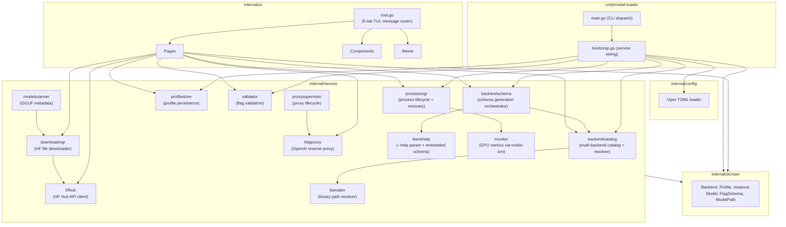

# model-loader Architecture

> Generated from GitNexus knowledge graph analysis (5545 symbols, 20290 relationships, 300 execution flows, 204 communities).

## Overview

**model-loader** is a TUI application for managing llama.cpp profiles and llama-server processes. Built with Go 1.26.2 + Charmbracelet bubbletea. It provides a 5-tab interface for discovering, configuring, launching, and monitoring LLM inference backends.

The architecture follows a layered design:

- **Entry Layer**: CLI commands (`cmd/model-loader/`)
- **Config Layer**: Viper-based TOML configuration (`internal/config/`)
- **Domain Layer**: Core types shared across all layers (`internal/domain/`)
- **Service Layer**: Business logic organized by functional area (`internal/service/`)
- **UI Layer**: Bubbletea TUI with pages and reusable components (`internal/ui/`)

## Functional Areas (Knowledge Graph Communities)

The knowledge graph identified 204 functional communities. The top areas by symbol count are:

| Area | Symbols | Cohesion | Description |
|------|---------|----------|-------------|
| **Process Manager** | 49 | 0.92 | Process lifecycle, launch, liveness, logs, history, instance recovery |
| **UI Pages — Server** | 46 | 0.98 | Server tab (proxy status, instance table, restart/kill) |
| **UI Root** | 40 | 0.88 | Root model, message routing, tab switching, resize handling |
| **Profile Store** | 36 | 0.85 | Profile persistence (filesystem-based CRUD, export) |
| **Backend Schema** | 33 | 0.76 | Schema generation orchestrator for all backend kinds |
| **UI Pages — Profiles** | 33 | 0.83 | Profiles tab + profile_editor sub-package (huh forms, draft state) |
| **UI Pages — Backends** | 27 | 0.84 | Backends tab (catalog management, probe events) |
| **UI Components — Proxy/Profile** | 25 | 0.89 | Proxy panel, profile picker, status bar |
| **UI Pages — Profiles List** | 22 | 0.62 | Profile list rendering, detail view |
| **HTTP Proxy** | 21 | 0.95 | OpenAI-shaped reverse proxy, handler, server |
| **Profile Editor** | 19 | 0.79 | huh-based profile editing with draft state machine |
| **UI Pages — Launcher/Models** | 18 | 0.59 | Launcher tab + Models tab (HF search, download queue) |
| **Download Manager** | 17 | 0.67 | Queued downloads with progress events |
| **UI Components — Picker/HF** | 16 | 0.98 | Model picker, HuggingFace search picker |
| **Llama Help Parser** | 15 | 0.97 | `--help` parser + embedded schema (pinned to v7376) |
| **Validator** | 14 | 0.86 | Flag validation rules |
| **Llama Binary Resolver** | 14 | 0.89 | Binary path resolver (PATH + Python fallback) |
| **Proxy Supervisor** | 14 | 0.98 | HTTP proxy lifecycle state machine |

## Cross-Layer Dependency Map

The `bootstrap` function (`cmd/model-loader/bootstrap.go`) wires all services together:

```
bootstrap
├── config.Load
├── backendcatalog.NewFSSchemaStore / NewFSStore
├── backendcatalog.NewResolver
├── backendschema.NewLlamaServerGenerator / NewVLLMGenerator / NewSGLangGenerator
├── backendschema.NewManager
├── migration.NewService
├── processmgr.New
├── profilestore.NewFSStore
└── validator.New
```

The TUI pages consume services directly:

- **LauncherPage** → `validator.HasBlockingErrors`, `processmgr`
- **ModelsPage** → `hfhub.Search`, `hfhub.RepoInfo`, `hfhub.DownloadURL`, `downloadmgr`
- **ProfilesPage** → `profilestore`
- **BackendsPage** → `backendcatalog`, `backendschema`
- **ServerPage** → `httpproxy`, `processmgr`, `proxysupervisor`

## Key Execution Flows

### 1. Backend Catalog Probing — `Probe → SplitCommandLine`

Cross-community flow (7 steps). Triggered when user adds a backend or on startup.

```
1. Prober.Probe
2. probeOne
3. resolveExecutable
4. ResolveCommandWithPythonFallback
5. resolver.Resolve
6. splitCommand
7. splitCommandLine
```

### 2. GGUF Model Scanning — `Scan → GgufHeader`

Cross-community flow (7 steps). Triggered from Models tab or profile picker.

```
1. fsScanner.Scan
2. scanRoot
3. buildModelFile
4. readMetaFromFile
5. readGGUFMeta
6. readGGUFHeader
7. ggufHeader
```

### 3. Profile Model Picker — `Update → PickerScanClosedMsg`

Cross-community flow (7 steps). Bubbletea message routing through UI layers.

```
1. ProfilesPage.Update
2. handlePickerScan
3. updatePicker
4. ModelPicker.Update
5. handleScanStarted
6. pickerWaitForEvent
7. PickerScanClosedMsg
```

### 4. Download Start — `Start → Draft`

Cross-community flow (7 steps). Queued download lifecycle in download manager.

```
1. Manager.Start
2. startLocked
3. runDownload
4. download
5. io.Closer.Close
6. close
7. Draft (message broadcast)
```

### 5. Download Cancel — `Cancel → State`

Cross-community flow (6 steps). Cancelation with state snapshot and queue advancement.

```
1. Manager.Cancel
2. startNextLocked
3. startLocked
4. runDownload
5. snapshotState
6. State (message broadcast)
```

## Architecture Diagram



## Notable Design Patterns

1. **Instance Recovery**: llama-server processes survive TUI exit. `processmgr.Reconcile` restores state from `~/.local/state/model-loader/instances.json` at boot.

2. **Multi-Backend Schema Generation**: `backendschema` orchestrates `AddBackend` for llama.cpp, vLLM, and SGLang via dedicated generators. Schema is embedded as fallback (pinned to llama.cpp build v7376) and regenerated at runtime if binary is present.

3. **Global Shortcut Gate**: Every shortcut in `RootModel.Update` that consumes a printable rune MUST be wrapped in `if !m.activePageCapturesInput()`. Pages with active huh forms/pickers implement `InputCapture`.

4. **Forward Non-Key Messages to huh**: Pages hosting `*huh.Form` MUST forward non-`tea.KeyMsg` messages to the form so its internal Cmd→Msg handshake completes.

5. **Golden Tests**: Schema parsing and UI snapshots use golden fixtures in `testdata/`. Update via `go test ./... -update`.

## File Layout

```
./
├── cmd/model-loader/
│   ├── main.go          # CLI entry: runTUI, runServe, runImport, resolveExportDir
│   └── bootstrap.go     # Service wiring + restart helper
├── internal/
│   ├── config/
│   │   └── config.go    # Viper TOML at ~/.config/model-loader/config.toml
│   ├── domain/
│   │   ├── backend.go
│   │   ├── backend_schema.go
│   │   ├── flag_schema.go
│   │   ├── flags.go
│   │   ├── instance.go
│   │   ├── model.go
│   │   ├── modelpath.go
│   │   ├── profile.go
│   │   └── schemabuilder.go
│   ├── service/
│   │   ├── backendcatalog/   # catalog.json + probe + resolver
│   │   ├── backendschema/    # schema generators (llama, vllm, sglang)
│   │   ├── downloadmgr/      # queued downloads + progress
│   │   ├── hfhub/            # model search, file listing
│   │   ├── httpproxy/        # OpenAI-shaped reverse proxy
│   │   ├── llamahelp/        # --help parser + embedded schema
│   │   ├── llamabin/         # binary path resolver
│   │   ├── modelscanner/     # GGUF metadata extraction
│   │   ├── monitor/          # GPU metrics
│   │   ├── processmgr/       # process lifecycle + instance recovery
│   │   ├── profilestore/     # FS-based profile CRUD
│   │   ├── proxysupervisor/  # proxy state machine
│   │   └── validator/        # flag validation rules
│   └── ui/
│       ├── components/    # Help, Modal, Picker, Sparkline, Statusbar, ProxyPanel, DownloadProgress, HF pickers
│       ├── pages/         # 5 tabs + profile_editor sub-package
│       │   ├── server.go
│       │   ├── profiles.go
│       │   ├── backends.go
│       │   ├── launcher.go
│       │   ├── models.go
│       │   └── profile_editor/
│       │       ├── editor.go
│       │       └── draft.go
│       ├── theme/
│       └── root.go        # RootModel, tab switching, global shortcuts
├── testdata/              # Golden fixtures
└── docs/superpowers/      # Design specs
```

## State & Config Paths

| File | Path |
|------|------|
| Config | `~/.config/model-loader/config.toml` |
| State (instances) | `~/.local/state/model-loader/instances.json` |
| Profiles | `~/.local/share/model-loader/profiles/` |
| Catalog | `~/.local/share/model-loader/catalog.json` |
| Logs | `~/.local/state/model-loader/logs/` |
| Download cache | `~/.cache/model-loader/` |

## Metrics

| Metric | Value |
|--------|-------|
| Files | 202 |
| Symbols | 5,545 |
| Relationships | 20,290 |
| Communities | 204 |
| Execution Flows | 300 |
| Indexed at | 2026-05-18 |
