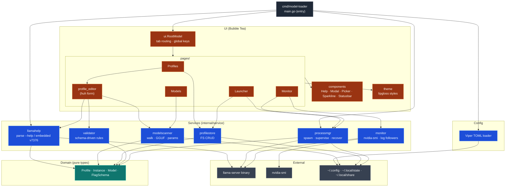

# Architecture — model-loader

> Generated from GitNexus knowledge graph on 2026-05-08 (commit `03d290a`).
> Repo: `model-loader` — TUI for managing `llama.cpp` profiles and `llama-server` processes (Go 1.26 + Charmbracelet bubbletea).

## Overview

The codebase is organized as a classic Go layered application split into a thin entry point (`cmd/model-loader/`) and a domain-driven `internal/` tree. The graph reports **102 files, 2,559 symbols, 6,702 edges, 64 communities, and 223 execution flows**, distributed across 14 functional clusters.

The system has three macro-responsibilities:

1. **Schema knowledge** — parse `llama-server --help` output (or fall back to an embedded snapshot pinned to build `v7376`) into a `FlagSchema`, used to validate profiles and drive form widgets.
2. **Profile lifecycle** — CRUD of TOML profiles on disk, plus a Bubble Tea TUI (Profiles / Models / Launcher / Monitor tabs) for editing and launching them.
3. **Process & telemetry** — spawn, supervise, and recover `llama-server` instances across TUI restarts, while streaming GPU/log telemetry into the Monitor page.

## Functional areas

The 14 communities discovered by GitNexus map cleanly onto the directory layout. Cohesion is the share of edges that stay inside the cluster — high values (>80%) indicate well-encapsulated modules.

| Cluster        | Symbols | Cohesion | Path                                | Role                                                                 |
|----------------|--------:|---------:|-------------------------------------|----------------------------------------------------------------------|
| Pages          | 246     | 79%      | `internal/ui/pages/`                | Tab pages: profiles, models, launcher, monitor.                      |
| Profile_editor | 57      | 78%      | `internal/ui/pages/profile_editor/` | Sub-model for the profile edit form (huh-driven).                    |
| Components     | 56      | 81%      | `internal/ui/components/`           | Help, Modal, Picker, Sparkline, Statusbar widgets.                   |
| Ui             | 45      | 82%      | `internal/ui/`                      | Root model + global key routing + tab dispatch.                      |
| Processmgr     | 45      | 79%      | `internal/service/processmgr/`      | Spawn / kill / reconcile `llama-server` processes.                   |
| Monitor        | 44      | 90%      | `internal/service/monitor/`         | GPU sampling (`nvidia-smi`) and log followers.                       |
| Modelscanner   | 31      | 91%      | `internal/service/modelscanner/`    | Walk model dirs, parse GGUF headers and sidecar params.              |
| Llamahelp      | 28      | 88%      | `internal/service/llamahelp/`       | Parse `llama-server --help` → `FlagSchema`; embed v7376 fallback.    |
| Profilestore   | 26      | 62%      | `internal/service/profilestore/`    | Filesystem CRUD for TOML profiles.                                   |
| Validator      | 16      | 68%      | `internal/service/validator/`       | Flag-by-flag validation rules driven by the schema.                  |
| Config         | 7       | 86%      | `internal/config/`                  | Viper TOML loader (`~/.config/model-loader/config.toml`).        |
| Theme          | 7       | 67%      | `internal/ui/theme/`                | Lipgloss color palette and styles.                                   |
| Domain         | 6       | 73%      | `internal/domain/`                  | Pure types: `Profile`, `Instance`, `Model`, `FlagSchema`.            |
| Filter         | 5       | 73%      | (within pages/components)           | Cross-page text-filter helpers.                                      |

The two highest-cohesion clusters (`Modelscanner` 91%, `Monitor` 90%) are infrastructure adapters with very few outward calls — exactly what you want from I/O modules. The lowest (`Profilestore` 62%) leaks into both `Domain` and `Validator`, which is expected because save/load go through validation.

## Key execution flows

GitNexus enumerated 223 processes (50 surfaced, top-by-depth). The five flows below cover the application's critical paths: schema bootstrap, profile editing, profile UI input, model discovery, and live monitoring.

### 1. `LoadSchema → SplitAndTrim` — boot-time schema parse

Loads the flag dictionary that everything else (validator, editor form, picker enums) depends on.

```
loadSchema           cmd/model-loader/main.go
  └─ Parse           internal/service/llamahelp/exec_parser.go
       └─ ParseHelp        internal/service/llamahelp/parser.go
            ├─ parseFlagLine
            │    ├─ inferType
            │    └─ parseEnumPlaceholder
            └─ splitAndTrim
```

If the binary is reachable, `exec_parser` shells out and feeds stdout into `ParseHelp`; otherwise the embedded `v7376` snapshot is used (see `internal/service/llamahelp/embedded.go`). The result is a `domain.FlagSchema` consulted by the editor and validator.

### 2. `Scan → FlagSpec` — model discovery feeding the editor

Triggered when the user opens the Profile Editor on a model directory.

```
Scan                 internal/service/modelscanner/scanner.go
  └─ scanRoot
       └─ buildModelFile
            └─ readParamsFromFile                 (sidecar params.json)
                 └─ Open                          internal/ui/pages/profile_editor/editor.go
                      └─ buildForm                internal/ui/pages/profile_editor/draft.go
                           └─ selectOptions
                                └─ Lookup         internal/domain/flag_schema.go
                                     └─ FlagSpec
```

Note how the trace crosses three communities (Modelscanner → Profile_editor → Domain). The schema lookup at the tail is what populates dropdowns/enums in the huh form.

### 3. `Subscribe → FlagSpec` — live log subscription wiring

Same `FlagSpec` tail, but entered from the Monitor side: when the user opens an instance's log tail, `Subscribe` starts a follower whose payload type still references the schema (e.g. for highlighting flag names in log lines).

```
Subscribe            internal/service/monitor/subscribe.go
  └─ startLogFollower
       └─ newLogFollower    internal/service/monitor/logs.go
            └─ Open          (profile_editor.editor)  ──► … ──► FlagSpec
```

### 4. `HandleKey → FlashClearMsg` — Profiles page keystroke loop

Demonstrates the Bubble Tea Update→Cmd cycle inside the highest-traffic page.

```
handleKey            internal/ui/pages/profiles.go
  └─ updatePicker
       └─ Update
            └─ handleLoaded
                 └─ withFlash                     (renders transient toast)
                      └─ scheduleFlashClear       internal/ui/pages/messages.go
                           └─ flashClearMsg       (delayed Cmd → Msg)
```

The `flashClearMsg` is the asynchronous tail that returns to `Update` after a delay and clears the toast — a textbook bubbletea pattern, captured here as a cross-community process because it crosses `Pages → messages helpers`.

### 5. `HandleMonitorEvent → FormatVRAM` — telemetry render path

Drives the Monitor tab whenever a new GPU/instance sample arrives.

```
handleMonitorEvent   internal/ui/pages/monitor.go
  └─ forwardToConfirms                   (route confirm dialogs first)
       └─ Update
            └─ handleInstancesRefreshed
                 └─ applyInstances        (reconcile state with snapshot)
                      └─ renderRows
                           └─ formatVRAM  (pretty-print MiB → "12.3 GiB")
```

`applyInstances` is the join point between `processmgr.Reconcile` (which owns `instances.json`) and the Monitor view; everything downstream is pure formatting.

## Mermaid — areas and connections



### How to read it

- **Solid arrows** are direct calls captured by the graph; **dashed boxes** are external boundaries (binaries, filesystem).
- The `Domain` cluster is the shared vocabulary — every service depends on it but it depends on nothing.
- `cmd/model-loader` is intentionally thin: bootstrap config, hydrate the schema, restore instances via `processmgr`, then hand control to `ui.RootModel`.
- The Profile Editor is the only UI component that talks to multiple services (validator + llamahelp + modelscanner) — that fan-out is why `Profile_editor` was extracted into its own package.

## Re-generating

```bash
npx gitnexus analyze    # reindex this repo
# then re-run /mcp__gitnexus__generate_map
```

The graph is current as of commit `03d290a` (branch `main`).
