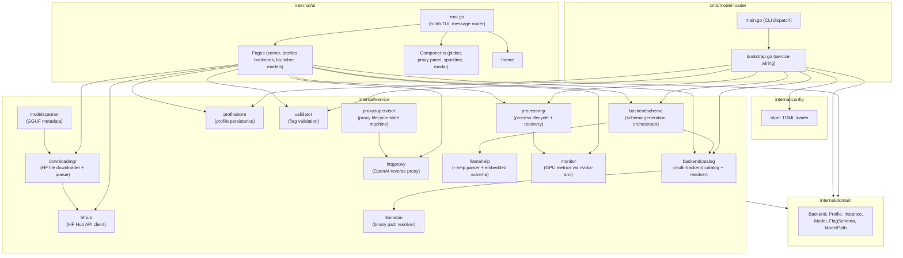

# model-loader Architecture

> Generated from GitNexus knowledge graph analysis (5,833 symbols, 21,113 relationships, 300 execution flows, 208 communities).

## Overview

**model-loader** is a TUI application for managing llama.cpp profiles and llama-server processes. Built with Go 1.26.2 + Charmbracelet bubbletea. It provides a 5-tab interface for discovering, configuring, launching, and monitoring LLM inference backends.

The architecture follows a layered design:

- **Entry Layer**: CLI commands (`cmd/model-loader/`)
- **Config Layer**: Viper-based TOML configuration (`internal/config/`)
- **Domain Layer**: Core types shared across all layers (`internal/domain/`)
- **Service Layer**: Business logic organized by functional area (`internal/service/`)
- **UI Layer**: Bubbletea TUI with pages and reusable components (`internal/ui/`)

## Functional Areas (Knowledge Graph Communities)

The knowledge graph identified 208 functional communities. The top areas by symbol count are:

| Area | Symbols | Cohesion | Description |
|------|---------|----------|-------------|
| **Process Manager** | 49 | 0.92 | Process lifecycle, launch, liveness, logs, history, instance recovery |
| **UI Pages — Server** | 46 | 0.98 | Server tab (proxy status, instance table, restart/kill, GPU metrics) |
| **Backend Schema** | 39 | 0.80 | Schema generation orchestrator for all backend kinds (llama.cpp, vLLM, SGLang) |
| **UI Root** | 39 | 0.87 | Root model, message routing, tab switching, resize handling |
| **UI Pages — Profiles** | 38 | 0.87 | Profiles tab + profile_editor sub-package (huh forms, draft state) |
| **Profile Store** | 36 | 0.85 | Profile persistence (filesystem-based CRUD, export, import) |
| **Download Manager** | 31 | 0.92 | Queued downloads with progress events, HF file downloader |
| **UI Pages — Backends** | 30 | 0.80 | Backends tab (catalog management, probe events) |
| **UI Pages — Profiles/Models** | 30 | 0.76 | Profiles tab + Models tab (HF search, download queue) |
| **UI Components — Proxy/Profile** | 25 | 0.89 | Proxy panel, profile picker, status bar |
| **UI Components — Modal/Help** | 25 | 0.98 | Help overlay, modal dialogs, flash messages |
| **HTTP Proxy** | 21 | 0.95 | OpenAI-shaped reverse proxy, handler, server |
| **Profile Editor** | 20 | 0.78 | huh-based profile editing with draft state machine |
| **Llama Help Parser** | 15 | 0.97 | `--help` parser + embedded schema (pinned to v7376) |
| **Llama Help — Schema** | 15 | 0.82 | Schema parsing and validation helpers |
| **Validator** | 14 | 0.86 | Flag validation rules |
| **Llama Binary Resolver** | 14 | 0.91 | Binary path resolver (PATH + Python fallback) |
| **Proxy Supervisor** | 14 | 0.98 | HTTP proxy lifecycle state machine |
| **Monitor — GPU** | 10 | 0.79 | GPU metrics via nvidia-smi / gopsutil fallback |
| **Model Scanner** | 9 | 0.97 | GGUF model metadata extraction |
| **HF Hub Client** | 8 | 0.77 | HuggingFace Hub API client (search, repo info, download URLs) |
| **Backend Catalog** | 7 | 0.93 | Multi-backend catalog + resolver |

## Cross-Layer Dependency Map

The `bootstrap` function (`cmd/model-loader/bootstrap.go`) wires all services together:

```
bootstrap
├── config.Load
├── backendcatalog.NewFSSchemaStore / NewFSStore
├── backendcatalog.NewResolver
├── backendschema.NewLlamaServerGenerator / NewVLLMGenerator / NewSGLangGenerator
├── backendschema.NewManager
├── migration.NewService
├── processmgr.New
├── profilestore.NewFSStore
└── validator.New
```

The TUI pages consume services directly:

- **LauncherPage** → `validator.HasBlockingErrors`, `processmgr`
- **ModelsPage** → `hfhub.Search`, `hfhub.RepoInfo`, `hfhub.DownloadURL`, `downloadmgr`
- **ProfilesPage** → `profilestore`
- **BackendsPage** → `backendcatalog`, `backendschema`
- **ServerPage** → `httpproxy`, `processmgr`, `proxysupervisor`, `monitor`

## Key Execution Flows

### 1. TUI Bootstrap — `RunTUI → Spawner`

Cross-community flow (6 steps). Entry point that wires the entire application.

```
1. runTUI                     (cmd/model-loader/main.go)
2. StartPolling               (internal/service/downloadmgr/manager.go)
3. pollLoop                   (internal/service/downloadmgr/manager.go)
4. tick                       (internal/service/downloadmgr/manager.go)
5. spawn                      (internal/service/downloadmgr/manager.go)
6. spawner                    (internal/service/downloadmgr/manager.go)
```

### 2. Backend Catalog Initialization — `EnsureDefaultCatalog → SchemaStoreRef`

Cross-community flow (3 steps). Ensures the default backend catalog exists at startup.

```
1. ensureDefaultCatalog       (cmd/model-loader/main.go)
2. WriteEmbeddedFallback      (internal/service/backendschema/generator.go)
3. schemaStoreRef             (internal/service/backendschema/generator.go)
```

### 3. GGUF Model Scanning — `Scan → GgufHeader`

Cross-community flow (7 steps). Triggered from Models tab or profile picker.

```
1. fsScanner.Scan             (internal/service/modelscanner/scanner.go)
2. scanRoot                   (internal/service/modelscanner/scanner.go)
3. buildModelFile             (internal/service/modelscanner/scanner.go)
4. readMetaFromFile           (internal/service/modelscanner/scanner.go)
5. readGGUFMeta               (internal/service/modelscanner/gguf.go)
6. readGGUFHeader             (internal/service/modelscanner/gguf.go)
7. ggufHeader                 (internal/service/modelscanner/gguf.go)
```

### 4. Process Launch — `LaunchForeground → WriteJSONAtomic`

Cross-community flow (5 steps). Launches llama-server, waits for enrichment, persists history.

```
1. launchForeground           (internal/service/processmgr/launch.go)
2. waitEnrichment             (internal/service/processmgr/enrichment.go)
3. persistHistory             (internal/service/processmgr/history.go)
4. saveHistory                (internal/service/processmgr/history.go)
5. WriteJSONAtomic            (internal/service/internal/fsx/atomic_write.go)
```

### 5. Process Watchdog — `HandleExit → RestartState`

Intra-community flow (3 steps). Monitors process exit and manages restart state.

```
1. Watchdog.HandleExit        (internal/service/processmgr/watchdog.go)
2. stateForPID                (internal/service/processmgr/watchdog.go)
3. restartState               (internal/service/processmgr/watchdog.go)
```

### 6. GPU Metrics Polling — `Run → GPUStats`

Intra-community flow (4 steps). Polls GPU metrics via nvidia-smi with gopsutil fallback.

```
1. gpuPoller.run              (internal/service/monitor/gpu.go)
2. pollOnce                   (internal/service/monitor/gpu.go)
3. tryGopsutil                (internal/service/monitor/gpu.go)
4. GPUStats                   (internal/service/monitor/monitor.go)
```

### 7. HTTP Proxy Forward — `HandleForward → ExtractFromBody`

Cross-community flow (3 steps). Receives OpenAI-shaped request, extracts profile ID, forwards.

```
1. Server.handleForward       (internal/service/httpproxy/handler.go)
2. extractProfileID           (internal/service/httpproxy/extract.go)
3. extractFromBody            (internal/service/httpproxy/extract.go)
```

### 8. Proxy Supervisor Lifecycle — `Status → WriteJSONAtomic`

Cross-community flow (3 steps). Manages proxy state and persists it atomically.

```
1. Supervisor.Status          (internal/service/proxysupervisor/supervisor.go)
2. saveState                  (internal/service/proxysupervisor/state.go)
3. WriteJSONAtomic            (internal/service/internal/fsx/atomic_write.go)
```

### 9. HuggingFace Search — `Search → SendJSON`

Cross-community flow (4 steps). Searches models on HuggingFace Hub.

```
1. hfSearcherAdapter.Search   (internal/ui/pages/models.go)
2. Client.Search              (internal/service/hfhub/client.go)
3. Client.doJSON              (internal/service/hfhub/client.go)
4. Client.sendJSON            (internal/service/hfhub/client.go)
```

## Architecture Diagram



## Notable Design Patterns

1. **Instance Recovery**: llama-server processes survive TUI exit. `processmgr.Reconcile` restores state from `~/.local/state/model-loader/instances.json` at boot.

2. **Multi-Backend Schema Generation**: `backendschema` orchestrates `AddBackend` for llama.cpp, vLLM, and SGLang via dedicated generators. Schema is embedded as fallback (pinned to llama.cpp build v7376) and regenerated at runtime if binary is present.

3. **Global Shortcut Gate**: Every shortcut in `RootModel.Update` that consumes a printable rune MUST be wrapped in `if !m.activePageCapturesInput()`. Pages with active huh forms/pickers implement `InputCapture`.

4. **Forward Non-Key Messages to huh**: Pages hosting `*huh.Form` MUST forward non-`tea.KeyMsg` messages to the form so its internal Cmd→Msg handshake completes.

5. **Golden Tests**: Schema parsing and UI snapshots use golden fixtures in `testdata/`. Update via `go test ./... -update`.

## File Layout

```
./
├── cmd/model-loader/
│   ├── main.go          # CLI entry: runTUI, runServe, runImport, resolveExportDir
│   └── bootstrap.go     # Service wiring + restart helper
├── internal/
│   ├── config/
│   │   └── config.go    # Viper TOML at ~/.config/model-loader/config.toml
│   ├── domain/
│   │   ├── backend.go
│   │   ├── backend_schema.go
│   │   ├── flag_schema.go
│   │   ├── flags.go
│   │   ├── instance.go
│   │   ├── model.go
│   │   ├── modelpath.go
│   │   ├── profile.go
│   │   └── schemabuilder.go
│   ├── service/
│   │   ├── backendcatalog/   # catalog.json + probe + resolver
│   │   ├── backendschema/    # schema generators (llama, vllm, sglang)
│   │   ├── downloadmgr/      # queued downloads + progress
│   │   ├── hfhub/            # model search, file listing
│   │   ├── httpproxy/        # OpenAI-shaped reverse proxy
│   │   ├── llamahelp/        # --help parser + embedded schema
│   │   ├── llamabin/         # binary path resolver
│   │   ├── modelscanner/     # GGUF metadata extraction
│   │   ├── monitor/          # GPU metrics
│   │   ├── processmgr/       # process lifecycle + instance recovery
│   │   ├── profilestore/     # FS-based profile CRUD
│   │   ├── proxysupervisor/  # proxy state machine
│   │   └── validator/        # flag validation rules
│   └── ui/
│       ├── components/    # Help, Modal, Picker, Sparkline, Statusbar, ProxyPanel, DownloadProgress, HF pickers
│       ├── pages/         # 5 tabs + profile_editor sub-package
│       │   ├── server.go
│       │   ├── profiles.go
│       │   ├── backends.go
│       │   ├── launcher.go
│       │   ├── models.go
│       │   └── profile_editor/
│       │       ├── editor.go
│       │       └── draft.go
│       ├── theme/
│       └── root.go        # RootModel, tab switching, global shortcuts
├── testdata/              # Golden fixtures
└── docs/superpowers/      # Design specs
```

## State & Config Paths

| File | Path |
|------|------|
| Config | `~/.config/model-loader/config.toml` |
| State (instances) | `~/.local/state/model-loader/instances.json` |
| Profiles | `~/.local/share/model-loader/profiles/` |
| Catalog | `~/.local/share/model-loader/catalog.json` |
| Logs | `~/.local/state/model-loader/logs/` |
| Download cache | `~/.cache/model-loader/` |

## Metrics

| Metric | Value |
|--------|-------|
| Files | 212 |
| Symbols | 5,833 |
| Relationships | 21,113 |
| Communities | 208 |
| Execution Flows | 300 |
| Indexed at | 2026-05-18 |
