# Architecture — model-loader

**Generated:** 2026-05-17  
**Stack:** Go 1.26.2 + Charmbracelet bubbletea  
**Pattern:** Event-driven TUI with domain-driven service layer

---

## Overview

model-loader is a terminal UI for managing `llama-server` profiles and processes. It is built as a single Go binary with a 6-tab bubbletea application (`tea.Program`) backed by a domain-driven service layer.

The architecture separates concerns into three layers:

| Layer | Responsibility |
|-------|--------------|
| **UI** (`internal/ui/`) | Bubbletea models, pages, components, theme — handles all user interaction |
| **Services** (`internal/service/`) | Business logic: process lifecycle, monitoring, persistence, validation, scanning |
| **Domain** (`internal/domain/`) | Zero-dependency shared types: Profile, Backend, Instance, Model, FlagSchema |

Configuration (`internal/config/`) sits adjacent to the layers and is loaded at boot before the TUI starts.

---

## Functional Areas (from knowledge graph)

| Area | Symbols | Cohesion | Role |
|------|---------|----------|------|
| **Pages** | 265 | 0.68 | 5 TUI tabs (Launcher, Profiles, Monitor, Models, Backends) |
| **Processmgr** | 82 | 0.73 | Spawn, kill, track, recover llama-server processes |
| **Backendschema** | 69 | 0.80 | Schema generation manager per backend |
| **Components** | 64 | 0.76 | Reusable widgets: picker, modal, sparkline, statusbar |
| **Profilestore** | 49 | 0.85 | CRUD + duplicate profiles as JSON files |
| **Profile_editor** | 46 | 0.70 | Inline profile creation/editing with huh forms |
| **Monitor** | 46 | 0.88 | Subscribe to logs, slots, health, GPU metrics |
| **Ui** | 45 | 0.71 | Root model, routing, key handling, boot blocker |
| **Modelscanner** | 32 | 0.88 | Walk filesystem, parse GGUF headers, emit scan events |
| **Llamahelp** | 21 | 0.90 | Parse `llama-server --help` into `FlagSchema` |
| **Backendcatalog** | 18 | 0.75 | Multi-backend catalog + schema resolver |
| **Validator** | 11 | 0.90 | FlagSchema validation rules engine |
| **Llamabin** | 10 | 0.90 | Binary resolution: PATH lookup, validation |
| **Domain** | 8 | 0.61 | Core domain structs (Profile, Instance, Model, FlagSchema) |
| **Theme** | 7 | 0.75 | Lipgloss styles, color palette |
| **Config** | — | — | Viper TOML loader, path expansion, defaults |
| **Migration** | — | — | One-time legacy binary-path → backend-ID migration |
| **Model-loader** | — | — | Entry point (`main.go`) |

> Knowledge graph: **3,986 symbols, 14,069 relationships, 141 communities, 300 processes** (Go layer only; `llamacpp/` external forks excluded).

---

## Layer Diagram

```mermaid
graph TD
    subgraph "UI Layer"
        Root["RootModel<br/>(internal/ui/root.go)"]
        Profiles["ProfilesPage"]
        Launcher["LauncherPage"]
        MonitorPg["MonitorPage"]
        ModelsPg["ModelsPage"]
        BackendsPg["BackendsPage"]
        ProfileEditor["ProfileEditor<br/>(inline huh forms)"]
        Components["Components<br/>(picker, modal, sparkline, statusbar)"]
        Theme["Theme<br/>(lipgloss palette)"]
    end

    subgraph "Service Layer"
        ProcessMgr["ProcessMgr<br/>(launch, kill, recover)"]
        MonitorSvc["Monitor<br/>(subscribe, logs, GPU)"]
        ProfileStore["ProfileStore<br/>(JSON CRUD)"]
        BackendCatalog["BackendCatalog<br/>(catalog + resolver)"]
        BackendSchema["BackendSchema<br/>(schema generation)"]
        LlamaHelp["LlamaHelp<br/>(--help parser)"]
        LlamaBin["LlamaBin<br/>(binary resolver)"]
        Validator["Validator<br/>(flag rules)"]
        ModelScanner["ModelScanner<br/>(GGUF walk)"]
        Migration["Migration<br/>(legacy → backend)"]
    end

    subgraph "Domain Layer"
        Domain["Domain Types<br/>(Profile, Backend, Instance, FlagSchema)"]
    end

    Config["Config<br/>(Viper TOML)"]

    Root --> Profiles
    Root --> Launcher
    Root --> MonitorPg
    Root --> ModelsPg
    Root --> BackendsPg
    Root --> ProfileEditor
    Root --> Components
    Root --> Theme

    Profiles --> ProfileStore
    Profiles --> BackendCatalog
    Profiles --> BackendSchema
    Profiles --> Validator
    Profiles --> ModelScanner

    Launcher --> ProcessMgr
    Launcher --> Validator
    Launcher --> BackendCatalog

    MonitorPg --> MonitorSvc
    ModelsPg --> ModelScanner
    BackendsPg --> BackendCatalog
    ProfileEditor --> ProfileStore
    ProfileEditor --> Validator
    ProfileEditor --> BackendCatalog

    ProcessMgr --> Domain
    MonitorSvc --> Domain
    ProfileStore --> Domain
    BackendCatalog --> Domain
    BackendSchema --> LlamaHelp
    BackendSchema --> LlamaBin
    BackendSchema --> BackendCatalog
    Validator --> Domain
    ModelScanner --> Domain
    Migration --> ProfileStore
    Migration --> BackendCatalog
    Migration --> BackendSchema

    Config --> Domain
    Root --> Config
```



---

## Key Execution Flows

### 1. Boot Sequence
**Trigger:** `cmd/model-loader/main.go`

```
main()
  → ExpandTilde() on config paths
  → Load AppConfig (Viper TOML, ApplyDefaults)
  → Init FSStore (profiles dir)
  → Init FsSchemaStore (backends/schemas dir)
  → Init BackendCatalog store
  → Init BackendSchema Manager + Register LlamaServerGenerator
  → Run MigrationService (legacy binary path → backend ID)
  → Init ProcessMgr + Reconcile (recover orphaned instances)
  → Build RootModel with all service dependencies
  → tea.NewProgram(rootModel).Run()
```

**Critical:** `Reconcile()` must run before any `Launch`/`Kill` to avoid losing track of background instances that survived a previous TUI exit.

---

### 2. Profile Launch
**Trigger:** User presses `Enter` on LauncherPage (or `L` on ProfilesPage)

```
LauncherPage.launchProfileCmd()
  → Validator.Validate(profile, schema) → Report
    → if blocking errors: show modal, abort
  → BackendCatalog.Resolver.Resolve(profile)
    → load catalog → find backend by ID (or default)
    → llamabin.Resolve(backend.Executable) → absolute path
    → SchemaStore.Load(schemaRef) → FlagSchema
  → ProcessMgr.Launch(profile, mode)
    → BuildArgs(profile) → []string for llama-server CLI
    → canonicalFlag() maps short keys (ngl → n-gpu-layers)
    → if Background: os.StartProcess(detached) + registry.Save()
    → if Foreground: exec.Cmd with TUI log streaming
    → Health check: TCP dial on profile port
  → If success: SwitchToMonitorMsg sent to root
```

**Constraint:** Only one foreground instance is allowed at a time. Manager enforces this.

---

### 3. Monitor Subscription
**Trigger:** User presses `Enter` on an instance in MonitorPage

```
MonitorPage.Update → MonitorSelectPIDMsg
  → Monitor.Subscribe(config)
    → Spawn 6 goroutines:
      1. Log tailer (fsnotify on <pid>.log)
      2. Log pump (non-blocking send to event channel)
      3. Slots poller (GET /health + GET /slots)
      4. Slots pump
      5. GPU poller (nvidia-smi fallback; gopsutil is no-op)
      6. Metrics ticker (rolling window: tokens/s, requests/s)
    → Unified 256-buffered event channel
    → Cancel func waits on sync.WaitGroup before close
  → MonitorPage subState.Apply(event) updates local model
  → renderSubViewBody() shows Logs / Slots / Metrics
```

**Constraint:** All pollers drop events on backpressure (non-blocking send with `default`). Channel must not be blocked by consumers.

---

### 4. Model Scan
**Trigger:** User opens Models tab (or Init in ModelPicker)

```
ModelsPage.Init → startScanCmd
  → ModelScanner.Scan(ctx, searchPaths)
    → Walk each path recursively
    → For each .gguf file:
      → Open file, read magic + header + KV pairs
      → Extract general.parameter_count, general.size_label
      → Fallback: parse quant/params from filename regex
      → Emit ScanEventFile on buffered channel (cap 64)
    → Emit ScanEventProgress per directory
    → Emit ScanEventDone on completion
  → ModelsPage Update receives events via tea.Cmd
    → File events: append to table rows
    → Progress events: update status bar
    → Done event: refresh table, show count
```

**Constraint:** Caller must drain the channel until close; otherwise the background goroutine leaks.

---

### 5. Backend Schema Generation
**Trigger:** User presses `Ctrl+B` in Profiles tab to add a new backend

```
ProfilesPage → AddBackendMsg
  → BackendSchema.Manager.AddBackend(ctx, name, executable, kind)
    → domain.Slugify(name) → backend ID
    → If kind == llama-server:
      → LlamaServerGenerator.Generate(backend)
        → If existing schema has source.editable=true: skip (preserve manual edits)
        → llamabin.Resolve(backend.Executable) → path
        → llamahelp.NewExecParserFor(path).Parse(ctx)
          → Runs llama-server --help with 10s timeout
          → Text parser: section regex → flag regex → type inference → FlagSchema
          → Fallback: llamahelp.EmbeddedSchema() if binary not found
        → FlagSchemaToBackend(fs, kind, id, source) → BackendValidationSchema
        → SchemaStore.Save(ref, schema) → JSON on disk
    → Upsert backend into catalog.Backends
    → If first backend: set DefaultBackendID
    → CatalogStore.Save(catalog)
  → UI refresh: reload backend list
```

**Constraint:** Schema is generated *before* catalog is saved so an invalid binary does not create a broken catalog entry. If catalog save fails after schema generation, the schema is left as an orphan (harmless).

---

## Knowledge Graph Execution Traces

The following step-by-step traces were extracted directly from the code knowledge graph (process nodes with `STEP_IN_PROCESS` relationships). They show the exact symbol-level call chains for the five most important cross-community flows.

### Trace 1: App Boot — `Main → ApplyDefaults`

| Step | Symbol | File |
|------|--------|------|
| 1 | `main` | `cmd/model-loader/main.go` |
| 2 | `Load` | `internal/config/config.go` |
| 3 | `LoadFrom` | `internal/config/config.go` |
| 4 | `applyDefaults` | `internal/config/config.go` |

**Type:** Cross-community · 4 steps  
`main` builds the full dependency graph: `Config`, `BackendCatalog`, `BackendSchema`, `Migration`, `ModelScanner`, `Monitor`, `ProcessMgr`, `ProfileStore`, `Validator`, then starts the TUI.

### Trace 2: Process Launch — `Launch → ReadStderrTail`

| Step | Symbol | File |
|------|--------|------|
| 1 | `Launch` | `internal/service/processmgr/manager.go` |
| 2 | `launchForeground` | `internal/service/processmgr/manager.go` |
| 3 | `waitEnrichment` | `internal/service/processmgr/manager.go` |
| 4 | `readStderrTail` | `internal/service/processmgr/exit_info.go` |

**Type:** Cross-community · 4 steps  
Builds CLI arguments, checks port availability, spawns the process, waits for health, captures stderr tail for error diagnosis, and persists the instance.

### Trace 3: Model Scanning — `Scan → GgufHeader`

| Step | Symbol | File |
|------|--------|------|
| 1 | `Scan` | `internal/service/modelscanner/scanner.go` |
| 2 | `scanRoot` | `internal/service/modelscanner/scanner.go` |
| 3 | `buildModelFile` | `internal/service/modelscanner/scanner.go` |
| 4 | `readParamsFromFile` | `internal/service/modelscanner/scanner.go` |
| 5 | `readGGUFParams` | `internal/service/modelscanner/gguf.go` |
| 6 | `readGGUFHeader` | `internal/service/modelscanner/gguf.go` |
| 7 | `ggufHeader` | `internal/service/modelscanner/gguf.go` |

**Type:** Cross-community · 7 steps  
Recursively walks directories, identifies `.gguf` files, reads binary headers and KV tensors to extract parameter count / quantization, then emits `ScanEvent` messages.

### Trace 4: Schema Generation — `Generate → FlagSpec`

| Step | Symbol | File |
|------|--------|------|
| 1 | `Generate` | `internal/service/backendschema/generator.go` |
| 2 | `Parse` | `internal/service/llamahelp/exec_parser.go` |
| 3 | `ParseHelp` | `internal/service/llamahelp/parser.go` |
| 4 | `parseFlagLine` | `internal/service/llamahelp/parser.go` |
| 5 | `FlagSpec` | `internal/domain/flag_schema.go` |

**Type:** Cross-community · 5 steps  
Invokes the backend binary with `--help`, parses output into structured `FlagSpec` objects, applies hard-coded overrides, and produces a `FlagSchema` consumed by the profile editor and validator.

### Trace 5: GPU Monitoring — `Run → MonitorEvent`

| Step | Symbol | File |
|------|--------|------|
| 1 | `run` | `internal/service/monitor/gpu.go` |
| 2 | `pollOnce` | `internal/service/monitor/gpu.go` |
| 3 | `nvidiaSMI` | `internal/service/monitor/gpu.go` |
| 4 | `pollLoop` | `internal/service/monitor/subscribe.go` |
| 5 | `pollSlots` | `internal/service/monitor/slots.go` |
| 6 | `sendEvent` | `internal/service/monitor/subscribe.go` |

**Type:** Cross-community · 6 steps  
Polls `nvidia-smi` for GPU VRAM, polls `/slots` and `/health` endpoints, aggregates rolling metrics, and pushes unified `MonitorEvent` values on a shared channel.

---

## File Map

```
cmd/model-loader/main.go          # Entry point: wire dependencies, boot TUI

internal/config/
  config.go                       # Viper TOML loader + defaults

internal/domain/
  profile.go                      # Profile, LaunchConfig, ProfileMeta
  backend.go                      # Backend, BackendCatalog, BackendKind
  instance.go                     # RunningInstance, ExitedInstance, LogLine
  model.go                        # ModelFile, ScanEvent
  flag_schema.go                  # FlagSchema, FlagSpec

internal/service/processmgr/
  processmgr.go                   # Manager interface + sentinel errors
  manager.go                      # Launch, Kill, List, WaitHealthy
  recover.go                      # Reconcile orphaned instances at boot
  registry.go                     # Persist running instances to instances.json
  args.go                         # BuildArgs, canonicalFlag
  exit_info.go                    # Capture stderr tail for error diagnosis
  history.go                      # Persisted exit history
  liveness.go                     # TCP health check

internal/service/monitor/
  monitor.go                      # Event types + Manager interface
  subscribe.go                    # Subscribe: 6-goroutine event pump
  logs.go                         # fsnotify log tailer
  slots.go                        # GET /health + GET /slots poller
  gpu.go                          # nvidia-smi parser
  metrics.go                      # Rolling window aggregator
  ring.go                         # Fixed-capacity log line buffer

internal/service/profilestore/
  store.go                        # Store interface
  fs_store.go                     # JSON persistence with atomic writes

internal/service/backendcatalog/
  store.go                        # Store + SchemaStore interfaces
  fs_store.go                     # Catalog + schema JSON persistence
  resolver.go                     # Resolve profile → backend + executable + schema
  default.go                      # DefaultCatalog for first-run

internal/service/backendschema/
  manager.go                      # CRUD backend + schema generation orchestration
  generator.go                    # Generator interface
  embedded_generator.go           # llama.cpp embedded schema generator
  sglang_generator.go             # sglang schema generator
  vllm_generator.go               # vLLM schema generator

internal/service/llamahelp/
  llamahelp.go                    # Parser interface
  parser.go                       # Text regex parser for --help output
  exec_parser.go                  # Invokes real binary
  embedded.go                     # Compile-time fallback schema

internal/service/llamabin/
  resolver.go                     # Resolve executable path (PATH lookup)

internal/service/modelscanner/
  modelscanner.go                 # Scanner interface
  scanner.go                      # Walk + event emission
  gguf.go                         # Binary GGUF header parser
  quant.go                        # Quantization regex from filename

internal/service/validator/
  validator.go                    # Validator interface
  rules.go                        # FlagSchema validation rules

internal/service/migration/
  migration.go                    # Legacy binary-path → backend-ID migration

internal/ui/
  root.go                         # RootModel: tab routing, key handling, boot blocker
  theme/theme.go                  # Lipgloss palette

internal/ui/pages/
  launcher.go                     # Tab 1: profile selection + launch
  profiles.go                     # Tab 2: profile CRUD master list
  profile_editor/
    editor.go                       # Inline huh form for profile editing
    draft.go                        # Draft profile state machine
  monitor.go                      # Tab 3: live GPU/logs/slots per instance
  models.go                       # Tab 4: GGUF model browser
  backends.go                     # Tab 5: backend catalog management
  messages.go                     # Cross-tab tea.Msg definitions

internal/ui/components/
  picker.go                       # File/model picker widget
  modal.go                        # Confirmation modal
  confirm.go                      # Yes/no dialog
  flash.go                        # Ephemeral status flash
  help.go                         # Help overlay
  sparkline.go                    # Mini line chart
  statusbar.go                    # Bottom bar with hints
  profile_picker.go               # Profile-specific picker
```

---

## Design Decisions

1. **Background processes survive TUI exit.** `ProcessMgr` uses `Setsid` + `instances.json` so users can close the TUI without killing their model server. `Reconcile()` restores the registry at next boot.

2. **Domain layer has zero external dependencies.** Every service depends only on `internal/domain` and stdlib, keeping the dependency graph shallow and testable.

3. **Schema is generated before catalog save.** `BackendSchema.Manager.AddBackend` generates the schema JSON first, then updates the catalog. This prevents broken catalog entries from invalid binaries.

4. **Non-blocking monitor events.** All 6 monitor goroutines drop events on backpressure. The unified channel is buffered (256) but consumers must not block.

5. **Atomic profile writes.** `FSStore.Save` uses temp-file + rename to prevent corrupt profiles on crash.

6. **Input capture contract.** Pages with active huh forms / pickers implement `InputCapture.IsCapturingInput()` so the root model does not steal printable keystrokes (e.g., typing `q` in a text field).

---

*Document generated via GitNexus knowledge graph analysis.*
