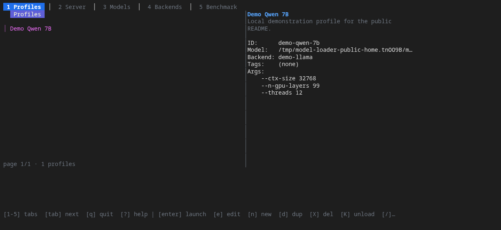

# model-loader

[](https://go.dev/)
[](LICENSE)
[](#project-status)

Run and benchmark local LLM inference servers from one terminal application.



`model-loader` is a Go TUI and headless CLI that manages launch profiles,
supervises inference processes, and exposes a single OpenAI-compatible endpoint.
When a request names another profile, the proxy can stop the current backend,
start the requested one, wait for it to become healthy, and forward the request.

It is designed for a single operator on a local GPU workstation. The reference
system has two RTX 3090 GPUs, but the process manager and profile model are not
tied to that exact hardware.

> [!WARNING]
> The proxy binds to loopback by default and has no authentication. Do not
> expose it to an untrusted network without an authenticated reverse proxy.

## Why model-loader?

- Manage multiple backends and versions without rewriting launch scripts.
- Keep tuned arguments in validated, portable profiles.
- Use one local endpoint while switching models on demand.
- Inspect logs, health, slots, GPU metrics, and throughput from the TUI.
- Search and download GGUF models from Hugging Face.
- Run 12 quality, speed, robustness, knowledge, and agentic benchmark modes.
- Automate the same operations through a complete Cobra CLI with JSON output.

## Supported backends

| Kind | Typical runtime |
|---|---|
| `llama-server` | llama.cpp |
| `vllm` | vLLM |
| `sglang` | SGLang |
| `dflash` | DFlash / DSpark |
| `buun-llama-cpp` | buun-llama-cpp |
| `beellama-cpp` | beellama.cpp |
| `ik-llama-cpp` | ik_llama.cpp |
| `unsloth` | Unsloth |
| `tabby` | TabbyAPI |

Backends are catalog entries, not bundled dependencies. Register the executable
you want to run and associate it with one of these kinds.

## Requirements

- Linux (process supervision relies on Linux process metadata and process groups)
- Go 1.26.2 or newer to build from source
- At least one compatible inference backend
- A model supported by that backend
- `nvidia-smi` for NVIDIA GPU monitoring (optional)
- Docker and the relevant harness only for agentic benchmark modes (optional)

No CGO is required.

## Install from source

Prebuilt Linux amd64 archives and checksums are available from
[GitHub Releases](https://github.com/quantmind-br/model-loader/releases).
Backend executables and model weights are intentionally not bundled.

To build the latest source instead:

```bash
git clone https://github.com/quantmind-br/model-loader.git
cd model-loader
make build
./bin/model-loader --version
```

To install the binary into `~/.local/bin`:

```bash
make install
```

Make sure `~/.local/bin` is on your `PATH` if you use `make install`.

## Quick start

1. Register a backend. The example below assumes `llama-server` is on `PATH`:

   ```bash
   model-loader backend add llama.cpp-local \
     --kind llama-server \
     --executable "$(command -v llama-server)"
   ```

   Replace the name or executable as needed. The interactive TUI also provides
   backend registration on the **Backends** tab. Use
   `model-loader backend add --help` for the command reference.

2. Start the TUI:

   ```bash
   model-loader
   ```

   On first run it creates
   `~/.config/model-loader/config.toml` (or the equivalent location under
   `$XDG_CONFIG_HOME`).

3. Create a profile on the **Profiles** tab, select its backend and model, then
   press `Enter` to load it through the proxy.

4. Send an OpenAI-compatible request. Profile IDs are model names:

   ```bash
   curl http://127.0.0.1:4321/v1/chat/completions \
     -H 'content-type: application/json' \
     -d '{
       "model": "my-profile",
       "messages": [{"role": "user", "content": "Hello"}]
     }'
   ```

The TUI intentionally leaves live inference processes running when it exits.
Use the Server tab or `model-loader instance stop` when you want to stop one.

## Headless operation

Run the proxy without the TUI:

```bash
model-loader serve
```

Useful endpoints include:

| Method | Path | Purpose |
|---|---|---|
| `POST` | `/v1/chat/completions` | OpenAI-compatible chat inference |
| `POST` | `/v1/messages` | Anthropic Messages translation |
| `POST` | `/v1/responses` | OpenAI Responses translation |
| `POST` | `/v1beta/models/{model}:generateContent` | Gemini translation |
| `GET` | `/v1/models` | List profiles as models |
| `GET` | `/_status` | Proxy and loaded-backend status |
| `POST` | `/_admin/load` | Explicitly load a profile |
| `POST` | `/_admin/unload` | Drain and unload the active backend |

See [HTTP proxy documentation](openwiki/http-proxy.md) for request shapes,
streaming behavior, compatibility details, and operational invariants.

## CLI

Running `model-loader` with no subcommand opens the TUI. The headless command
tree mirrors its main operations:

```text
model-loader backend    # register, inspect, probe, and update backends
model-loader profile    # create, validate, import, and export profiles
model-loader instance   # start, stop, inspect, and monitor processes
model-loader model      # scan local models and use Hugging Face
model-loader benchmark  # run and inspect evaluations
model-loader serve      # run the proxy in the foreground
```

Every table-oriented command supports the global `--json` flag. Use
`model-loader <command> --help` as the canonical command reference.

## Configuration and state

| Location | Contents |
|---|---|
| `~/.config/model-loader/config.toml` | Application configuration |
| `~/.config/model-loader/profiles/` | Versioned profile JSON files |
| `~/.config/model-loader/backends/` | Backend catalog and validation schemas |
| `~/.local/state/model-loader/` | Instance, proxy, metric, benchmark, and download state |
| `~/.local/state/model-loader/logs/` | Application and backend logs |

XDG configuration overrides are honored. See the
[configuration reference](docs/config.md) for all settings and precedence
rules, and [troubleshooting](docs/troubleshooting.md) for common failures.

## Documentation

- [OpenWiki quickstart](openwiki/quickstart.md): documentation map and feature overview
- [Architecture](openwiki/architecture.md): boundaries, data flow, and state ownership
- [Process manager](openwiki/process-manager.md): lifecycle and recovery guarantees
- [Backend schemas](openwiki/backend-schema.md): schema generation and overlays
- [Benchmark engine](openwiki/benchmark.md): modes, scoring, and external harnesses
- [Testing and QA](openwiki/testing.md): test structure and project quality gate
- [Profile JSON Schema](docs/profile-schema.json): canonical machine-readable profile contract

## Contributing

Contributions are welcome: bug fixes, backend integrations, documentation,
tests, and focused usability improvements all help. Start with
[CONTRIBUTING.md](CONTRIBUTING.md), read the relevant OpenWiki page, and open an
issue before undertaking a broad design change.

```bash
go build ./...
go test ./...
```

Please follow the [Code of Conduct](CODE_OF_CONDUCT.md). Security issues should
be reported through the private process in [SECURITY.md](SECURITY.md), not a
public issue.

## Project status

The project is under active development and currently optimized for a single
trusted operator on Linux. Interfaces and persisted schemas may evolve before
a stable `v1.0.0` release. Known defects are tracked in
[GitHub Issues](https://github.com/quantmind-br/model-loader/issues); historical
regression identifiers are explained in [`BUGS.md`](BUGS.md).

## License

Licensed under the [Zero-Clause BSD License](LICENSE). You may use, copy,
modify, and distribute the software without an attribution requirement.
