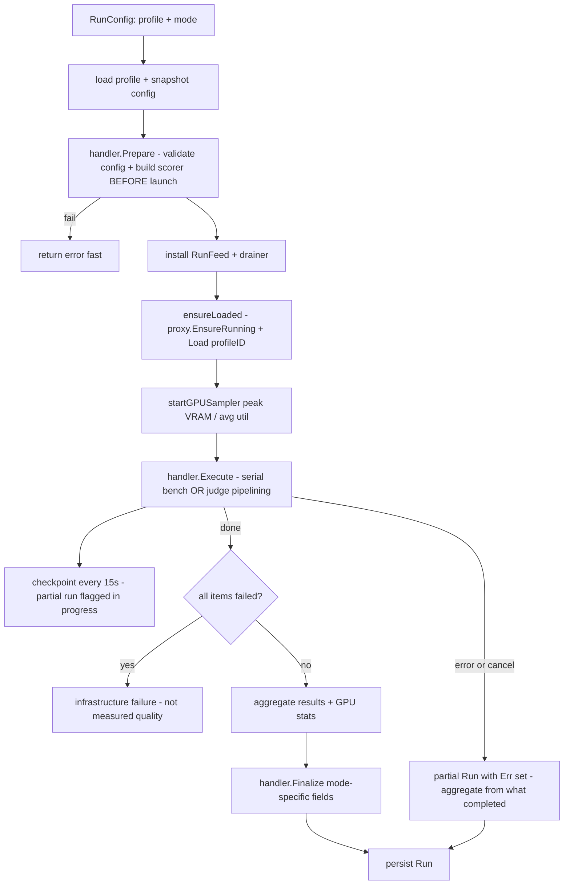

# Benchmark Engine

`internal/service/benchmark/` evaluates profiles across 12 modes in 5 categories. The engine loads a profile through the proxy, runs each mode's problems, scores them (objective check or LLM-judge), and persists results. Three **agentic** modes shell out to external harnesses running in Docker.

## The 12 modes

`modeOrder` in `handler.go` is the **single source of truth**. `ModesInOrder()` filters it through the registry; `handler_test.go` enforces `modeOrder` ↔ registry sync. The CLI mode list derives from it (BR8) — do not introduce a second literal.

| # | Mode | Category | Scoring |
|---|------|----------|---------|
| 1 | `judge` (SWE-bench Lite) | **Quality** | LLM judge — reference-guided weighted rubric (localization 0.30, correctness 0.45, completeness 0.15, maintainability 0.10). |
| 2 | `math-bench` (GSM8K) | Quality | Objective — exact numeric match. |
| 3 | `codegen-bench` (HumanEval) | Quality | Objective — sandboxed Python unit-test pass (Pass@1). |
| 4 | `ragas-bench` (RAG) | Quality | Grader — faithfulness + relevancy + precision. |
| 5 | `summary-bench` | Quality | Grader — coherence + fact coverage. |
| 6 | `llama-bench` (throughput) | **Speed** | Objective — TTFT + tok/s. |
| 7 | `longctx` (needle probe) | **Robustness** | Objective — multi-needle retrieval + speed. |
| 8 | `instruction-bench` | Robustness | Objective — format/refusal/consistency. |
| 9 | `mmlu-bench` | **Knowledge** | Objective — multiple-choice exact match. |
| 10 | `terminal-bench` | **Agentic** | External harness (Docker) → `results.json`. |
| 11 | `swe-bench-pro` | Agentic | External harness (Docker) → `eval_results.json`. |
| 12 | `deep-swe` | Agentic | External harness (Docker) → per-trial result. |

Each handler registers itself in a package `init()` via `registerHandler(...)`. The `modeHandler` interface requires `Mode()`, `Category()`, `Count(r)`, `Prepare(r)`, `Execute(...)`, `Finalize(...)`.

## Run pipeline

`Runner.Run()` (`runner.go`) is the orchestration entry point. `RunConfig` carries the profile, mode, and all knobs; `Config` (built from `app.BenchmarkConfig`) holds the per-mode settings.



Caption: the run pipeline. `Prepare` fail-fast validates before the expensive backend launch. Partial runs are persisted with `Err` set and excluded from the leaderboard (flagged `in progress`) until the final save overwrites. An all-items-failed run is classified as infrastructure failure, not measured quality (BR2).

Two execution strategies: **serial bench** (every non-judge mode — one infer → one score per item, checkpoint after each) and **judge pipelining** (inference is strictly serial so speed metrics stay clean, but scoring runs in background goroutines overlapped with the next problem's inference via a semaphore of size 2).

## Judge and scoring

Two distinct judge layers:

- **`judgeScorer`** (`scorer.go`) — the SWE-bench Lite quality scorer. Scores against a reference patch with a weighted rubric. **Self-consistency**: samples the judge `samples` times (sample 0 deterministic at temp 0; later samples at temp 0.3); final score = **median** of samples; `resolved` = **strict majority** vote. Degrades gracefully if some samples fail.
- **`llmGrader`** (`grader.go`) — a general single-criterion grader used by ragas-bench and summary-bench. Each mode calls it multiple times for its criteria (faithfulness, relevancy, coherence, etc.).

Judge endpoint resolution (`graderFor`/`newScorer`): an **external judge** (gold standard) when `Judge.BaseURL` + `Judge.Model` are configured (`judgedBy="external"`); otherwise **self-judge** (zero-config, the model-under-test grades itself, `judgedBy="self"`). Both paths emit an `OnDelta` activity heartbeat so a slow judge still shows liveness.

Objective modes (no judge): `math-bench` strips `<think>` and matches numeric answers; `mmlu-bench` extracts multiple-choice letters; `codegen-bench` runs code under a `bwrap` sandbox (no network, read-only system dirs) or subprocess fallback; `instruction-bench` checks format/refusal/consistency; `longctx` plants needles at ~25/50/75% depth in generated pseudo-code; `llama-bench` prefills context then generates with `ignore_eos`, averaging TTFT/TPS over reps.

## Agentic harness integration

All three agentic modes follow the same pattern: **shell out to an external Python CLI, point it at the proxy via LiteLLM `openai/<profile-id>`, parse results files back into `ProblemResult`**. The engine never installs the harness or Docker.

| Mode | Harness | Key behavior |
|------|---------|--------------|
| `terminal-bench` | `tb` CLI (laude-institute/terminal-bench), Terminus agent in Dockerized tmux | Pinned `terminal-bench-core==0.1.1`; fixed run id; parses `results.json`; `Finalize` sets `TerminalBenchAccuracy`. |
| `swe-bench-pro` | scaleapi/SWE-bench_Pro-os | Three stages: generate patches → `gather_patches.py` → `swe_bench_pro_eval.py` in per-instance Docker images. Parses `eval_results.json`. **Gotcha**: the bundled eval JSONL uses UPPERCASE keys while the eval reads lowercase — operator must supply a raw sample with lowercase columns. |
| `deep-swe` | `pier` CLI (datacurve-ai/pier), DeepSWE corpus | Forces `model_class=litellm` (mini-swe-agent's Responses-API adapter is incompatible with llama-server); API base must be host-reachable (`host.docker.internal`) since the agent runs inside the container. |

Shared infrastructure: process-group ownership (`Setpgid`, `SIGKILL(-pid)`, `WaitDelay=10s`), harness logging (tees to `<state-dir>/benchmark/harness/<mode>-<timestamp>.log` + bounded in-memory tail — BR7), and LiteLLM routing via `tbAPIBase(base)` → `<proxy>/v1`.

## Watchdog and hang detection

A shared stall watchdog (`runHangWatchdog`, used by terminal-bench and deep-swe) polls completed-task count at `tbWatchInterval`:
- **Stall detection** — if no new task scored for the stall timeout (configurable; default built-in) → kill the process group (prevents a wedged Docker task pinning the GPU — BUGS UIUX-012).
- **Completion detection** — if `completed >= total` but the harness won't exit → after a post-complete grace, kill it; the run is still successful.

Feed staleness (separate, for UI rendering): agentic quiet after 3 min / stalled after 9 min; local quiet after 45 s / stalled after 2 min 15 s. Inference timeout scales with `max_tokens` (base `Timeout` + `MaxTokens/decodeFloorTPS(15)`) so a large token budget on a slow model does not spuriously time out.

## Deterministic sampling

`internal/service/benchmark/sample.go` provides `sampleIDs(ids, n, seed)` — a deterministic `n`-element subset (copy → sort → seeded PCG shuffle → truncate → re-sort). Same `(ids, n, seed)` always selects the same subset regardless of input order. Since the external harnesses lack a uniform seed/count flag, the subset is resolved **locally** before building CLI args: terminal-bench expands `--n-tasks` into an explicit `--task-id` list; swe-bench-pro reads instance ids from the raw sample then samples. The CLI `--limit` flag maps to these per-mode reducers.

## Result persistence

`internal/service/benchmarkstore/fs_store.go` stores runs at `<state-dir>/benchmark/runs`. `Save` atomically writes `<id>.json`; if `Transcript` is non-empty it writes a separate `<id>.transcript.json` sidecar (kept out of the run JSON that feeds list/compare views). `List` sorts newest-first and skips corrupt files; a path-traversal guard rejects empty/`..`/separator ids before `filepath.Join`.

## CLI subcommand tree

```
benchmark run        --profile <id> --mode <m> [--limit N] [--min-solve 0.x] [agentic flags]
benchmark list                          # all runs, newest first
benchmark compare                       # latest run per profile
benchmark history <profile-id>          # one profile's runs
benchmark show <run-id>                 # full result detail
benchmark transcript <run-id>           # raw per-problem I/O
benchmark export <run-id> [--dir ..]    # JSON + CSV
benchmark delete <run-id> --yes
benchmark web                           # read-only viewer (configweb)
```

`app.BenchmarkConfig(cfg)` is the **single** mapping literal from `config.AppConfig.Benchmark` to `benchmark.Config`. A comment in `benchmark_config.go` warns: duplicating this literal once cost DeepSWE its CLI wiring — wire it via the accessor only. The TUI `benchmark web` (and TUI `W`) reuses `configweb` for a read-only benchmark viewer with an htmx live monitor.

## Key files

| File | Role |
|------|------|
| `runner.go` | `Runner`, `Run()` pipeline, `ensureLoaded`, `newScorer`, `graderFor`. |
| `handler.go` | `modeHandler` interface, registry, `modeOrder`, `ModesInOrder()`, `executeSerialBench`. |
| `handlers.go` | `judgeHandler` (judge pipelining), `longContextHandler`, `llamaBenchHandler`. |
| `grader.go` / `scorer.go` | `llmGrader` / `judgeScorer` + system prompts + self-consistency. |
| `client.go` | OpenAI-compatible streamed completion client. |
| `config.go` | `Config` — all knobs for every mode + agentic harness fields. |
| `sample.go` | `sampleIDs` deterministic subset selection. |
| `tracker.go` | `RunFeed` live snapshot + staleness thresholds. |
| `export.go` | `ExportRun` → JSON + CSV. |
| `metrics_scale.go` | `CeilingsFor` data-relative bar normalization. |
| `gpu_sampler.go` | background peak-VRAM / avg-util sampler. |
| per-mode files | `swebenchpro.go`, `terminalbench.go`, `deepswe.go`, `mathbench.go`, `mmlubench.go`, `codegenbench.go`, `ragasbench.go`, `summarybench.go`, `instructionbench.go`, `llamabench_probe.go`, `longcontext_probe.go`. |
