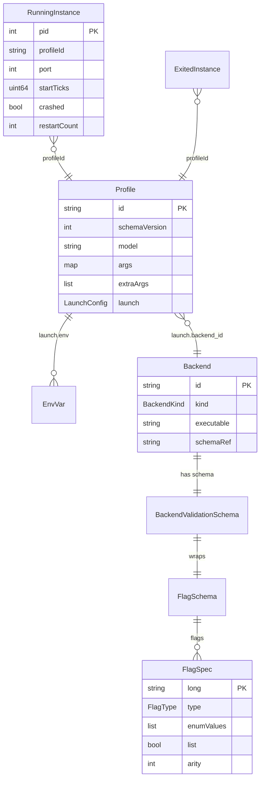

# Data Model

`internal/domain/` holds shared types with **zero external dependencies**. Everything else — process management, validation, the proxy, the TUI — operates on these types. Keeping them dependency-free is a hard rule: do not add imports here.

## Entities and relationships

Caption: a Profile selects exactly one Backend by id; each Backend has one validation Schema wrapping a FlagSchema of FlagSpecs. A launched profile becomes a RunningInstance keyed by PID; on exit it is archived as an ExitedInstance.

## Profile

`Profile` (`internal/domain/profile.go`) is a persisted launch configuration. `SchemaVersion` is `3` and is **the** version of `docs/profile-schema.json`; editing `domain.Profile` requires editing the JSON Schema in the same commit.

Key fields:
- `ID` — lowercase kebab/slug (`^[a-z0-9]+([._-][a-z0-9]+)*$`); the filename basename **equals** the id.
- `Model` — path to the model file (typically a `.gguf`).
- `Args map[string]any` — validated flag values. Ints round-trip as `float64` via JSON (see `validator.checkType`). The `port` key is **reserved** — the process manager allocates an ephemeral loopback port and injects it on Launch.
- `ExtraArgs []string` — raw passthrough to the backend binary; deliberately **not** type/enum-checked (only emits a warning for unrecognized flags).
- `Launch.LaunchConfig` — `BackendID` (selects the catalog backend), `DefaultBackground`, per-profile `Env`, `RestartPolicy`, `MaxRestarts`, `BackoffSeconds`. `ResolvedExecutable` and `ResolvedBackendKind` are set at launch time only (not persisted).

`RestartPolicy` is `"none" | "on-failure" | "always"`. See [Process Manager](process-manager.md) for how `MaxRestarts`/`BackoffSeconds` drive the restart engine.

## Backend and BackendKind

`Backend` (`internal/domain/backend.go`) is a catalog entry: an `ID` (kebab catalog id like `llama.cpp-stable`, `sglang-dflash`), a `Kind` (one of 11 `BackendKind` constants), the `Executable` path, and a `SchemaRef`. A `kind` may have multiple `backend_id`s — `backend_id ≠ kind`.

`BackendKind` constants: `llama-server`, `vllm`, `sglang`, `dflash`, `buun-llama-cpp`, `beellama-cpp`, `ik-llama-cpp`, `unsloth`, `tabby`, `lmstudio`, `freetoken`. Operators register each backend (binary + kind) via `model-loader backend add`.

## Instances

`RunningInstance` (`internal/domain/instance.go`) describes a live process tracked by the process manager. It is keyed by PID and carries:
- `StartTicks` — `/proc/<pid>/stat` field 22 captured at launch. Combined with PID it detects PID recycling (audits A1/A11). `0` = unknown (legacy entry or `/proc` read failure); identity checks then degrade to `Alive`.
- `Kind` — the backend kind, stamped at launch. **Not** reconstructed on reconcile/recovery; a recovered-but-not-relaunched instance may carry an empty Kind. For launch-time use only.
- `Crashed`, `ExitCode`, `ExitSignal`, `ExitReason`, `StderrTail` — populated by the `cmd.Wait` reaper at exit.

`ExitedInstance` is the archived record persisted to `instances-history.json`. `ExitReasonOperatorStop = "operator-stop"` is written when a backend was terminated deliberately (via `processmgr.Kill`) so exit classification can distinguish an intentional stop from a crash.

`ExitClass(ri)` maps an instance to an operator-facing label with precedence: `operator-stop` → "stopped"; signal/nonzero exit → "crashed"; clean exit → "exited".

## FlagSchema and validation schema

`FlagSpec` (`internal/domain/flag_schema.go`) is the per-flag descriptor:
- `Type FlagType` — `Bool`, `Int`, `Float`, `String`, or `Enum`.
- `EnumValues []string` + `List bool` — when `List=true`, the validator splits the value on `,` (or accepts a JSON array) and checks each element. This is the mechanism behind `spec-type` chaining (see [Backend Schema](backend-schema.md)).
- `Keywords []string` — non-numeric literals a numeric flag also accepts (e.g. `n-gpu-layers` takes an int, `auto`, or `all`).
- `Arity int` — argv token count; `>1` is rejected in `Profile.Args` and must go through `Profile.ExtraArgs` (BUGS.md S15).
- `AllowedInts []int` — exact-match allowlist added for buun's `sleep-idle-seconds: -1`.
- Constraints: `Min/Max *int`, `FloatMin/FloatMax *float64`, `IsPort bool` (1–65535).

`BackendValidationSchema` (`internal/domain/backend_schema.go`) is the versioned envelope (`SchemaVersion: 1`, `Kind: "cli-flags.v1"`) wrapping a `FlagSchema`. Its `Source` records `GeneratedFrom` (executable path or `embedded-golden`/`embedded-fallback`), `Editable` (capability, always true from generators), and `Customized` (dirty marker — only set by operator write paths). It also carries `Presentation` (group/essentials layout) and `Rules []CrossFieldRule` (declarative: `When` condition → `Then` effect). See [Backend Schema](backend-schema.md) for how these are generated.

## Persistence

| Artifact | Location | Writer |
|----------|----------|--------|
| Profile JSON | `~/.config/model-loader/profiles/<id>.json` | `profilestore` (atomic, `WriteJSONExclusive` for new files) |
| Catalog | `~/.config/model-loader/backends/catalog.json` | `backendcatalog` |
| Schema JSON | `~/.config/model-loader/backends/schemas/<id>.json` | `backendschema.Manager` |
| Instance registry | `~/.local/state/model-loader/instances.json` | `processmgr` (flock-guarded deltas) |
| Exit history | `~/.local/state/model-loader/instances-history.json` | `processmgr` |
