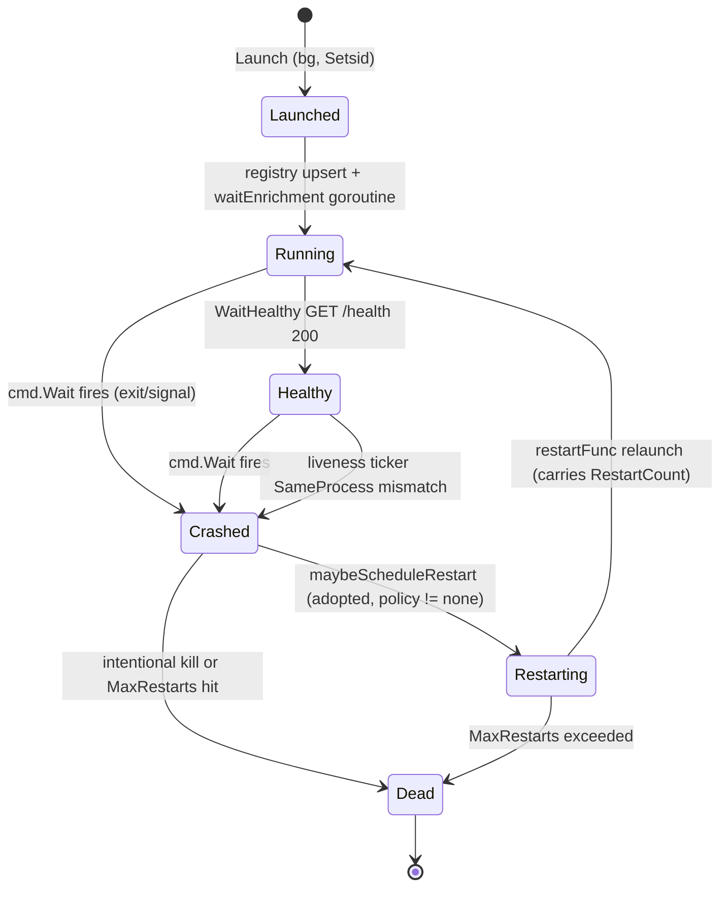

# Process Manager

`internal/service/processmgr/` is the largest service package. It launches backend processes, supervises them, persists their state, and restarts them on crash. Its central design constraint is that the TUI and `serve` daemon **coexist** and both write the same `instances.json` — safely, via flock-guarded deltas and identity-aware liveness.

## Lifecycle

A background launch goes: resolve binary + kind → allocate an ephemeral loopback port → `cmd.Start()` with `Setsid:true` (session leader so group-kill sweeps children) → capture `StartTicks` → register `tracked[pid]` + `hasReaper[pid]` → **mutateRegistry upsert** → **only then** start the `waitEnrichment` reaper goroutine (P-C4: a fast-crash `Crashed` delta can never be clobbered by the launch's running-state delta).

Caption: the process lifecycle. Adopted instances (post-`Reconcile`, no `*exec.Cmd` handle) are restarted by the liveness ticker; owned instances are restarted by the reaper. `maybeScheduleRestart` is skipped for intentional kills (`killRequested`) and deduped by `restartScheduled` (audit A10). `WaitHealthy` success zeroes `RestartCount`, so `MaxRestarts` bounds **consecutive failed starts**, not lifetime restarts.

## Identity-aware liveness

PID reuse is defended everywhere (audit A11). The primitives in `manager.go`:

| Primitive | Purpose |
|-----------|---------|
| `StartTicks(pid)` | `/proc/<pid>/stat` field 22 (starttime in clock ticks) — uniquely identifies a process incarnation. |
| `SameProcess(pid, startTicks)` | `Alive(pid) && starttime matches`. `startTicks==0` degrades to `Alive` (legacy entries). |
| `hasReaper[pid]` | Marks PIDs with a live `waitEnrichment` goroutine. Adopted instances (post-reconcile) are absent → **liveness drives their restart** instead (audit A10). |
| `killRequested[pid]` | Set under `m.mu` **before** signaling so the reaper/liveness label the exit `operator-stop` and skip the restart policy (audit A4). |
| `restartScheduled[pid]` | Set-once dedupe so reaper + liveness can't both fire a restart for the same dead PID (audit A10). |
| `pendingRestarts[profileID]` | Carries `RestartCount` across the death→relaunch boundary so `MaxRestarts` actually bounds a crash loop (audit A5). |

The liveness probe (`liveness.go`) runs every 5s and is literally `procutil.SameProcess(ri.PID, ri.StartTicks)` — a recycled PID (same number, different starttime) is correctly detected as dead. `Kill` on a recycled PID returns `nil` without signaling the innocent occupant (idempotent-stop semantics).

## Registry writes

`mutateRegistry` (`registry.go`) is the **sole** write path to `instances.json`. It is a flock-guarded, delta-based read-modify-write:

1. `fsx.WithFileLock(path+".lock", ...)` → blocking `LOCK_EX`. Lock failure is **non-fatal** — `fn` runs unserialized rather than erroring.
2. Load the current file inside the lock. A load error **aborts without writing** — never wipe on parse failure.
3. Hand a `map[int]RunningInstance` keyed by PID to the caller's `mutate` closure.
4. Atomic save via `WriteJSONAtomic` (unique temp name `.<base>.tmp-*` + `os.Rename`; the unique name avoids a cross-writer rename race, P-C9).

There are six documented `mutateRegistry` callsites, all running **outside** `m.mu` so file I/O never serializes against `Launch`/`Kill`: `Launch` (bg), `launchForeground`, `Kill` (×2), `waitEnrichment` reaper, liveness ticker, and `Reconcile`. Callers touch only the PIDs they own, so concurrent writers (TUI vs `serve`) cannot erase each other's launches (audit A7). Adding a seventh requires updating this contract and the audit docs.

## Group kill and `ErrStillAlive`

Background processes spawn with `SysProcAttr.Setsid: true` (so `pgid == pid`); `procutil.TerminateTree` then signals the whole group, killing vLLM EngineCore/Worker_TP and SGLang trees with the leader. Escalation: `SIGTERM` → poll `Alive` (100ms, up to grace) → `SIGKILL` → confirm gone (up to `killConfirmGrace = 15s`).

The `ErrStillAlive` path is critical: `TerminateTree` returns it if a process wedged in uninterruptible GPU/CUDA teardown never dies. `Kill` then **does not** drop the entry from `tracked`/registry — an "alive but unregistered" orphan is the leak that OOMs the next load (audits P4/DF11). The caller aborts the swap; `killRequested` stays set so the eventual death is not restarted as a crash.

## Health, readiness, and Python backends

- `WaitHealthy` polls `GET /health` with exponential backoff (100ms→1s). On 200: `MarkLastUsed`, `RestartCount=0`.
- `WaitReady` (`readiness.go`): unsloth backends tail the log for `sk-unsloth-[0-9a-f]{32}` (the token is both the readiness signal and the upstream auth key; incremental reads carry 64 bytes so a split token still matches). Others poll `/health`. Returns the auth token the proxy injects outbound.
- `healthCheckTimeout` default is **180s** in the proxy; **360s** in `serve` (a 35B int4 TP=2 multimodal MoE whose Marlin expert repack can run minutes).
- `PYTHONUNBUFFERED=1` is injected at spawn for vLLM/SGLang/Unsloth/Tabby (Python backends). Without it their block-buffered output appears in late bursts under the Server-tab tail.
- `extractExit` uses `syscall.WaitStatus` for signal detection (Linux-leaning, with a graceful `, ok` guard).

## Reconcile and recovery

`Reconcile` (state-owner only, at boot) re-validates every disk entry via `entryAlive` (StartTicks identity check, with legacy `/proc/<pid>/comm` + cmdline heuristics as fallback), drops dead/recycled entries, and rewrites the registry. Observers use `RefreshFromDisk` which identity-filters without persisting. `List()` (mtime/size cache, audit C3) never surfaces a dead/recycled disk entry.

## Key files

| File | Role |
|------|------|
| `processmgr.go` | `Manager` interface + `LaunchMode` enum + sentinel errors (`ErrModelNotFound`, `ErrForegroundBusy`, `ErrHealthCheckTimeout`, `ErrStillAlive`). |
| `manager.go` | `fsManager` impl; holds `tracked`, `hasReaper`, `killRequested`, `restartScheduled`, `pendingRestarts`; `Kill`/`List`/`MarkOperatorStop`/`GetExitInfo`/`Close`. |
| `launch.go` | `Launch`/`launchForeground`/`prepareLaunch`; port allocation, `Setsid`, `buildLaunchEnv` (`PYTHONUNBUFFERED`), `makeCommand`. |
| `enrichment.go` | `WaitHealthy` + `waitEnrichment` reaper + `extractExit`. |
| `readiness.go` | `WaitReady` (unsloth log-token vs `/health`). |
| `recover.go` | `Reconcile`/`RefreshFromDisk`/`entryAlive`. |
| `liveness.go` | `startLiveness` — 5s ticker, identity-aware crash detection. |
| `restart.go` | `maybeScheduleRestart` — the restart policy engine. |
| `registry.go` | `mutateRegistry` — flock-guarded delta RMW. |
| `prune.go` | `PruneBackendLogs` — per-profile log retention. |
| `history.go` | Exit-history persistence (`instances-history.json`). |
| `exit_info.go` | `ExitInfo`, `readStderrTail` (50 lines / 64 KiB cap). |
